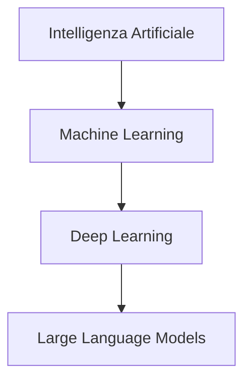

# Argomenti del corso

- Introduzione alla Programmazione Assistita da AI
- Il Ruolo dell'Al come Assistente Intelligente
- L'Arte del Prompt Efficace
- Iterazione e Ottimizzazione dei Prompt

---

# Terminologia

- **Modello**: rete neurale addestrata a prevedere la parola/token successivo
- **Contesto**: finestra limitata di testo che guida la risposta
- **Prompt**: istruzioni testuali usate per ottenere un comportamento desiderato
- **Agent**: sistema che combina il modello con strumenti esterni e loop di ragionamento

---

# Machine Learning e Deep Learning

## Machine Learning (ML)

Sottocampo dell'AI dove i sistemi **imparano dai dati** senza essere programmati esplicitamente.

## Deep Learning (DL)

Sottocampo del ML che usa **reti neurali artificiali profonde** (molti livelli) per apprendere rappresentazioni complesse.

## Relazione gerarchica



---

# Cos'è un LLM

**Large Language Model** (LLM): modello linguistico di grandi dimensioni basato su reti neurali.

## Caratteristiche principali

- Miliardi di parametri (pesi neurali)
- Addestrato su enormi quantità di testo da Internet
- Capace di comprendere e generare linguaggio naturale
- Capace di generare codice in molti linguaggi di programmazione

## Esempi

GPT-4, Claude, Gemini, Llama, DeepSeek

---

# Architettura Transformer

Gli LLM moderni si basano sull'architettura **Transformer** (2017), che usa meccanismi di **attenzione** per elaborare il linguaggio.

## Meccanismo di attenzione

Permette al modello di "concentrarsi" su parti rilevanti del contesto quando genera ogni token.

## Vantaggi rispetto a architetture precedenti

- Elaborazione parallela (più veloce)
- Cattura relazioni a lungo raggio nel testo
- Scala efficacemente con dati e potenza di calcolo

---

# Come funzionano gli LLM: processo di generazione

## Processo passo-passo

1. **Tokenizzazione**: il testo viene diviso in token (pezzi di parole)
   - Esempio: `"printf"` → `["print", "f"]`
2. **Embedding**: ogni token diventa un vettore numerico
   - Rappresentazione matematica del significato
3. **Elaborazione**: passaggio attraverso molti layer di trasformazione
   - Centinaia di miliardi di operazioni matematiche
4. **Predizione**: il modello predice il token successivo più probabile
   - Calcola probabilità per tutti i possibili token

Il processo si ripete token per token fino a generare la risposta completa.

---

# LLM come strumenti probabilistici

## Concetto fondamentale ⚠️

Gli LLM **non comprendono** il linguaggio come gli umani.

Sono modelli statistici che predicono la sequenza di parole più probabile.

## Come funziona la predizione

- Dato un contesto (prompt), il modello calcola la probabilità di ogni possibile token successivo
- Sceglie il token con probabilità più alta (o campiona dalla distribuzione)
- Ripete il processo per generare testo completo

## Esempio

Input: `"Il sole sorge a..."`

- `"est"` → 85%
- `"oriente"` → 10%
- `"ovest"` → 2%

---

# Implicazioni della natura probabilistica

## Vantaggi

- Output fluido e naturale
- Creatività e variabilità nelle risposte
- Capacità di gestire input imperfetti

## Limiti

- **Allucinazioni**: generazione di informazioni false ma plausibili
- **Inconsistenza**: output diversi per stesso input
- **Mancanza di ragionamento logico** vero
- **Nessuna garanzia** di correttezza

## Regola d'oro ⚠️

**Valida sempre l'output** - compila, testa, verifica la logica del codice generato

---

# Temperature e casualità

Gli LLM permettono di controllare la casualità dell'output tramite il parametro **temperature**.

## Temperature bassa (0.0 - 0.3)

- Output deterministico e prevedibile
- Sceglie sempre il token più probabile
- **Uso**: codice, traduzioni, task tecnici

## Temperature media (0.5 - 0.7)

- Bilanciamento tra prevedibilità e creatività
- **Uso**: scrittura generale, assistenza

## Temperature alta (0.8 - 1.0+)

- Output creativo e vario
- Maggiore casualità nella selezione
- **Uso**: brainstorming, scrittura creativa

---

# Context window: concetti base

## Cos'è il Context Window

Quantità massima di testo che un LLM può "vedere" contemporaneamente (input + output).

È come la **memoria a breve termine** del modello.

## Misurazione in token

Il context window si misura in **token**, non in parole:

- 1 token ≈ 0.75 parole in inglese
- 1 token ≈ 0.5-0.7 parole in italiano

Esempio: `"printf(\"Hello\");"` = circa 5-6 token

---

# Context window: limiti pratici

## Esempi di limiti nei modelli attuali

- **GPT-3.5**: 4K-16K token (~3K-12K parole)
- **GPT-4**: 8K-128K token (~6K-96K parole)
- **Claude 3**: fino a 200K token (~150K parole)

## Implicazioni pratiche per lo sviluppo

- **Conversazioni lunghe** "dimenticano" l'inizio
- **Documenti troppo lunghi** vanno divisi in parti
- **Necessità di riassumere** periodicamente il contesto
- **File di codice grandi** potrebbero non entrare completamente
- Strategia: fornire solo il codice rilevante al task corrente

---

# Cos'è una Chat AI

Una **Chat AI** (o chatbot AI) è un'interfaccia conversazionale che permette di interagire con un LLM tramite dialogo in linguaggio naturale.

## Componenti principali

- **LLM sottostante**: il modello che genera risposte
- **Interfaccia utente**: dove si scrive e si legge
- **Memoria conversazionale**: mantiene il contesto del dialogo
- **System prompt**: istruzioni che definiscono il comportamento

## Esempi

ChatGPT, Claude, Gemini, Perplexity, GitHub Copilot Chat

---

# Cos'è un AI Agent

Un **AI Agent** è un sistema AI più avanzato che può:

- Pianificare sequenze di azioni
- Usare strumenti esterni (API, database, esecuzione codice)
- Prendere decisioni autonome
- Eseguire task complessi multi-step

## Esempio pratico

Sistema che cerca informazioni su web, legge documenti, scrive un report e lo invia via email.

---

# Chat AI vs AI Agent: differenze

## Confronto delle caratteristiche

| Aspetto | Chat AI | AI Agent |
| --------- | --------- | ---------- |
| Interazione | Risponde a domande | Esegue azioni |
| Autonomia | Limitata | Elevata |
| Strumenti | Solo LLM | LLM + tool esterni |
| Complessità | Singolo scambio | Multi-step planning |

## Quando usare cosa

- **Chat AI**: per spiegazioni, suggerimenti, completamento codice
- **AI Agent**: per task complessi che richiedono più passi e uso di strumenti

---

# LM Studio: eseguire LLM in locale

LM Studio permette di scaricare ed eseguire modelli LLM sul proprio computer.

**Vantaggi**: privacy, nessun costo API, lavoro offline

---

# Perché usare agent AI nello sviluppo C

- Ridurre tempo di boilerplate (init, parsing, test) mantenendo focus sulla logica
- Ottenere spiegazioni rapide di warning e bug prima del debug manuale
- Esplorare alternative di design senza riscrivere tutto a mano
- Mantenere coerenza di stile e naming in team

---

# GitHub Copilot in breve

- Suggerimenti inline mentre si scrive in CLion (C, CMake, markdown)
- Copilot Chat per spiegazioni, refactoring, generazione test e fix mirati
- Non esegue il codice: serve sempre compilare/testare e fare review umana
- Può proporre codice non sicuro o incompleto: verificare input, error handling, limiti

---

# Prerequisiti

- Conoscenze di base del C (tipi, funzioni, array, puntatori semplici)
- Esperienza iniziale con CLion: creazione progetto, build, run, debugger
- Ambiente pronto con compilatore C (gcc/clang) e CLion installato

---

# Strumenti di lavoro

- CLion con toolchain C configurata
- Terminale per compilare ed eseguire
- Assistente AI testuale (es. Copilot Chat) integrato nell'IDE o nel browser
- Risorse progetto: repository, task tracker, documentazione

---

# Uso responsabile e limiti

- Verificare sempre il codice generato: compilazione, test, lettura manuale
- Non condividere dati sensibili nei prompt
- Citare la fonte AI quando si riutilizzano frammenti significativi
- Preferire piccoli passi iterativi per mantenere il controllo
- Conservare decisioni e motivazioni nei messaggi di commit

---

# Flusso di lavoro assistito (pattern)

- Definisci il contesto: obiettivo, vincoli, file coinvolti
- Chiedi un output piccolo e verificabile
- Esegui e osserva errori o warning
- Condividi log e snippet minimi nell'IDE/chat
- Itera fino a un risultato compilabile e leggibile

---

# Strutturare i prompt

- Contesto: cosa fa il programma, vincoli (C99, senza librerie extra)
- Compito: cosa vuoi ottenere (funzione, test, refactoring)
- Vincoli: lunghezza, stile, interfacce esistenti
- Output: formato atteso (solo codice, spiegazione breve, passi)

---

# Prompt di esempio (generazione)

Testo da dare all'assistente:

```text
Ho un programma C su CLion. Scrivi una funzione C99 che calcola la media di un array di int.
Non usare librerie extra. Mantieni i parametri const ove possibile. Aggiungi un breve commento.
Restituisci solo il codice della funzione.
```

---

# Esempio di codice generato

```c
#include <stddef.h>

double mean_ints(const int *values, size_t count) {
    if (values == NULL || count == 0) {
        return 0.0; // defend against invalid input
    }

    long sum = 0;
    for (size_t i = 0; i < count; ++i) {
        sum += values[i];
    }

    return (double)sum / (double)count;
}
```

---

# Ora 1 - Cosa vedrai

- Ruolo dell'AI nello sviluppo C
- Obiettivi pratici del corso e modalità d'uso in CLion
- Aspettative: suggerimenti, non magia

---

# Ora 1 - Setup minimo

- CLion installato con toolchain C (gcc/clang)
- Progetto C vuoto per provare i prompt
- Copilot Chat attivo per domande e correzioni rapide

---

# Ora 1 - Perché usare AI ora

- Ridurre tempo su boilerplate e ricerca API
- Ottenere spiegazioni immediate di warning
- Generare alternative e confrontarle rapidamente

---

# Ora 1 - Rischi comuni

- Accettare codice senza verifiche
- Prompt vaghi che producono output inutili
- Dipendenza dall'assistente per concetti base

---

# Ora 1 - Metriche di successo

- Compila al primo tentativo dopo piccole correzioni
- Patch piccole e leggibili
- Test eseguiti su casi limite

---

# Ora 1 - Terminologia rapida

- Token: unità di testo che il modello predice
- Context window: quante istruzioni può ricordare
- Temperature: quanto variazione negli output (bassa = più deterministica)

---

# Ora 1 - Mini esercizio

- Chiedi all'assistente: "Spiega in 3 bullet cosa fa un compilatore C"
- Verifica sintesi e chiarezza
- Nota come risponde a prompt brevi

---

# Ora 2 - Tipi di assistenti

- Suggerimenti inline (completamento token)
- Chat contestuale su selezione di codice
- Agent che leggono file, eseguono test, propongono patch

---

# Ora 2 - Casi d'uso rapidi

- Generare scheletro di funzioni
- Spiegare warning del compilatore
- Proporre test per un input edge

---

# Ora 2 - Quando non usarlo

- Codice che gestisce dati sensibili
- Parti del progetto non comprese a fondo
- Urgenze senza tempo per verifiche

---

# Ora 2 - Manuale vs assistito

- Manuale: controllo totale ma più lento
- Assistito: velocità maggiore, richiede verifica
- Obiettivo: combinare velocità e controllo

---

# Ora 2 - Mini workflow

- Scrivi commento della funzione
- Genera con Copilot, accetta o rigenera
- Compila subito e osserva warning

---

# Ora 2 - Salva le richieste efficaci

- Mantieni un file di prompt riutilizzabili
- Annota il contesto e il risultato ottenuto
- Riutilizza con piccole modifiche

---

# Ora 2 - Esercizio

- Chiedi: "Genera funzione C che somma array di int e gestisce null"
- Compila e misura quanto devi correggere
- Aggiorna il prompt per ridurre le correzioni

---

# Ora 3 - Antipattern di prompt

- Prompt troppo generici: output inutilizzabile
- Richieste doppie o contraddittorie
- Incollare troppo codice irrilevante

---

# Ora 3 - Refinement iterativo

- Step 1: chiedi versione breve
- Step 2: aggiungi vincoli (C99, niente allocazioni dinamiche)
- Step 3: chiedi solo codice finale

---

# Ora 3 - Template: generazione funzione

```text
Contesto: programma C per gestione array di int.
Compito: scrivi funzione C99 che trova il massimo.
Vincoli: niente librerie extra, gestisci array vuoto.
Output: solo codice della funzione, con breve commento.
```

---

# Ora 3 - Template: debug

```text
Ho questo warning di clang: ...
Ecco la funzione minima: ...
Spiega la causa probabile e proponi una patch minima.
Restituisci solo la funzione corretta.
```

---

# Ora 3 - Contesto minimo sufficiente

- Linguaggio e standard (C99)
- Firma attesa e range input
- Limiti: niente malloc se non necessario

---

# Ora 3 - Output controllato

- Chiedi "solo codice" o "3 bullet"
- Evita spiegazioni lunghe se non servono
- Specifica se vuoi commenti o no

---

# Ora 4 - Checklist rapida prima di chiedere

- Qual è il file o la funzione? incolla solo il necessario
- Vincoli dichiarati (C99, no librerie esterne, limiti di input)
- Formato di output richiesto (solo codice, patch, 3 bullet)
- Test o input di esempio da usare per validare

---

# Glossario della Lezione 1

- **Prompt**: istruzione testuale per il modello
- **Token**: unità minima di testo
- **Context window**: testo che il modello può considerare
- **Hallucination**: output plausibile ma errato
- **LLM**: Large Language Model

---

# Riepilogo Lezione 1

- Fondamenti di AI, ML, Deep Learning
- Architettura Transformer e LLM moderni
- Natura probabilistica degli LLM e relative implicazioni
- Differenza tra Chat AI e AI Agent
- Basi per strutturare prompt efficaci
