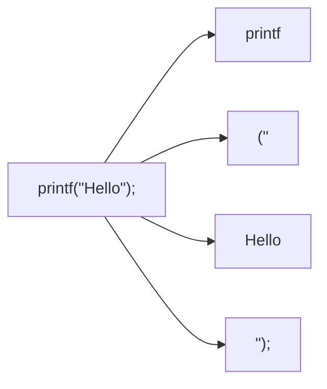
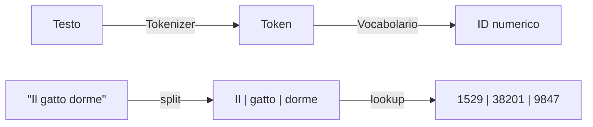
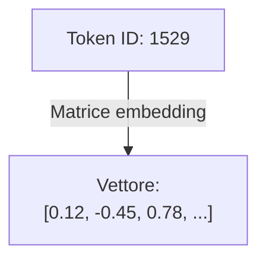
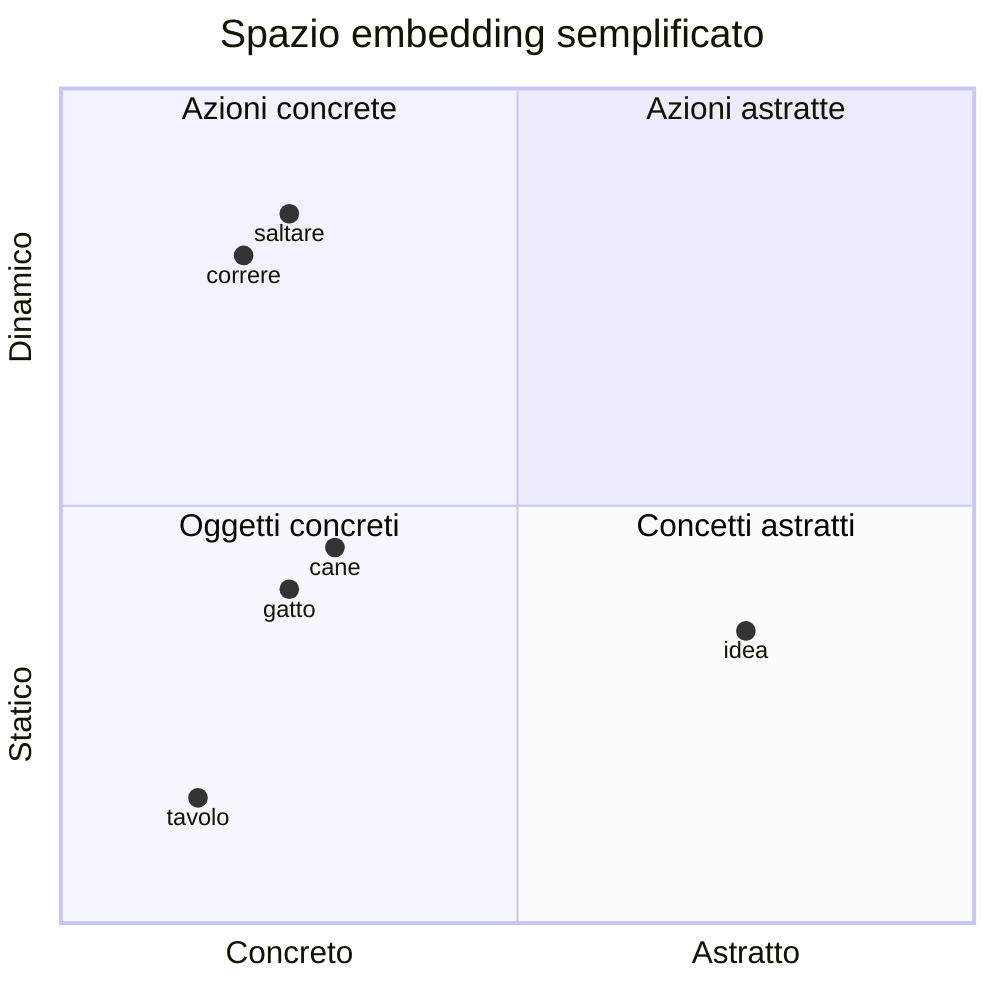
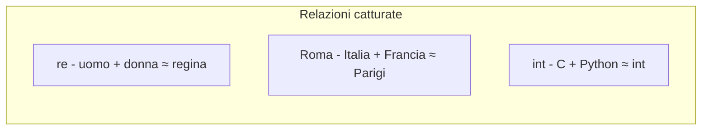
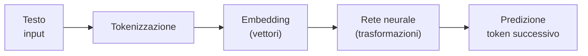
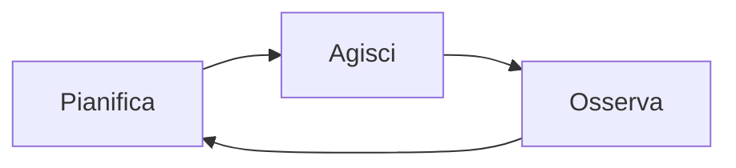

# Rispondi al sondaggio

Scansiona il QR code con il telefono

oppure

vai su slido.com e inserisci il codice:

## 1468 331

::right::


<!-- https://wall.sli.do/event/4JqN2FQ25AgprK61sixSzx?section=935314ea-1825-4ca1-bd24-50111172a8c6&integration=shared-present-mode&utm_source=slidoadmin -->

---

# Terminologia

Quale è il significato di questi termini?

| Termine | Definizione |
| --- | --- |
| Modello | ? |
| Contesto | ? |
| Prompt | ? |
| Agent | ? |

---

# Terminologia — Tabella completa

| Termine | Definizione |
| --- | --- |
| Modello | Rete neurale addestrata a prevedere il token successivo. |
| Contesto | Finestra limitata di testo che guida la risposta del modello. |
| Prompt | Istruzioni testuali usate per ottenere un comportamento desiderato. |
| Agent | Sistema che combina il modello con strumenti esterni e loop di ragionamento. |

---
layout: figure
figureUrl: /AI_venn.png
figureCaption: "Source: Wikipedia - AI, ML, DL, LLM relationship"
title: AI, ML, DL, LLM relationship

---

---

# Cos'è un LLM

**Large Language Model** (LLM): modello linguistico di grandi dimensioni basato su reti neurali.

## Caratteristiche principali

- Miliardi di parametri (pesi neurali)
- Addestrato su enormi quantità di testo da Internet
- Capace di comprendere e generare linguaggio naturale
- Capace di generare codice in molti linguaggi di programmazione

## Esempi

GPT-4, Claude, Gemini, Llama, DeepSeek

---
layout: two-cols

---

# LLM come strumenti probabilistici

## Esempio

Input: `"Il sole sorge a..."`

- `"est"` → 85%
- `"oriente"` → 10%
- `"ovest"` → 2%

::right::

## Concetto fondamentale

Gli LLM **non comprendono** il linguaggio come gli umani.

Sono modelli statistici che predicono la sequenza di parole più probabile.

## Come funziona la predizione

- Dato un contesto (prompt), il modello calcola la probabilità di ogni possibile token successivo
- Sceglie il token con probabilità più alta (o campiona dalla distribuzione)
- Ripete il processo per generare testo completo

---

# Implicazioni della natura probabilistica

## Vantaggi

- Output fluido e naturale
- Creatività e variabilità nelle risposte
- Capacità di gestire input imperfetti

## Limiti

- **Allucinazioni**: generazione di informazioni false ma plausibili
- **Inconsistenza**: output diversi per stesso input
- **Mancanza di ragionamento logico** vero
- **Nessuna garanzia** di correttezza

## Regola d'oro

**Valida sempre l'output** - compila, testa, verifica la logica del codice generato

---

# Temperature e casualità

Gli LLM permettono di controllare la casualità dell'output tramite il parametro **temperature**.

## Temperature bassa (0.0 - 0.3)

- Output deterministico e prevedibile
- Sceglie sempre il token più probabile
- **Uso**: codice, traduzioni, task tecnici

## Temperature media (0.5 - 0.7)

- Bilanciamento tra prevedibilità e creatività
- **Uso**: scrittura generale, assistenza

## Temperature alta (0.8 - 1.0+)

- Output creativo e vario
- Maggiore casualità nella selezione
- **Uso**: brainstorming, scrittura creativa

---

# Temperature: effetto sulla distribuzione

Prompt: `"Il sole sorge a..."` — come cambia la distribuzione dei token al variare della temperature.

| Token | Temp 0.1 | Temp 0.7 | Temp 1.2 |
| ------- | ---------- | ---------- | ---------- |
| est | 95 % | 55 % | 30 % |
| oriente | 4 % | 20 % | 22 % |
| mattina | 1 % | 12 % | 18 % |
| ovest | 0 % | 8 % | 16 % |
| alba | 0 % | 5 % | 14 % |

- **Bassa**: distribuzione concentrata, scelta quasi deterministica
- **Alta**: distribuzione più uniforme, maggiore variabilità

---

# Cos'è un Token?

Un **token** è l'unità minima di testo che un LLM elabora: non una lettera, non sempre una parola intera.



- Il **tokenizer** divide il testo in pezzi chiamati token
- Una parola comune = 1 token; una parola rara = più token
- I numeri, la punteggiatura e il codice vengono tokenizzati in modo specifico

---
layout: two-cols

---

# Token: esempi pratici

## Frase in italiano

`"Il gatto dorme"` → 3-4 token

| Pezzo | Token |
| --- | --- |
| Il | 1 |
| gatto | 1 |
| dorme | 1 |

::right::

## Codice C

`"int x = 5;"` → 5 token

| Pezzo | Token |
| --- | --- |
| int | 1 |
| x | 1 |
| = | 1 |
| 5 | 1 |
| ; | 1 |

---

# Token: esempi pratici

## Ordini di grandezza

- 1 token ≈ 0.75 parole (inglese)
- 1 token ≈ 0.5-0.7 parole (italiano)
- 100 token ≈ 75 parole ≈ mezza pagina

## Perché è importante?

- I modelli hanno un **limite massimo di token** (context window)
- Ogni token ha un **costo** nei servizi cloud
- Prompt più lunghi = meno spazio per la risposta

---

# Dal testo al numero: la tokenizzazione

Un LLM non legge lettere: converte ogni token in un **numero intero** (ID) tramite un vocabolario fisso.



- Il vocabolario è fisso (es. GPT-4 ha circa 100.000 token)
- Parole fuori vocabolario vengono spezzate in sotto-token
- Esempio: `"programmazione"` potrebbe diventare `"programm"` + `"azione"`

---
layout: two-cols

---

# Cos'è un Embedding?

Un **embedding** è la rappresentazione di un token come **vettore di numeri reali** in uno spazio multidimensionale.



- Ogni token diventa un punto nello spazio
- Vettori con centinaia di dimensioni (es. 768 o 4096)
- Parole simili → vettori vicini

::right::

## Analogia visiva (2D)



Parole con significato simile sono **vicine** nello spazio.

---

# Embedding: perché sono importanti

Gli embedding permettono al modello di "capire" le **relazioni semantiche** tra parole.



## Pipeline completa: dal testo alla predizione



Ogni volta che un LLM genera una parola, attraversa tutta questa pipeline.

---

# Context window: concetti base

## Cos'è il Context Window

Quantità massima di testo che un LLM può "vedere" contemporaneamente (input + output).

È come la **memoria a breve termine** del modello.

Si misura in token

Esempio: `"printf(\"Hello\");"` = circa 5-6 token

---

# Context window: limiti pratici

## Implicazioni pratiche per lo sviluppo

- **Conversazioni lunghe** "dimenticano" l'inizio
- **Documenti troppo lunghi** vanno divisi in parti
- **Necessità di riassumere** periodicamente il contesto
- **File di codice grandi** potrebbero non entrare completamente
- Strategia: fornire solo il codice rilevante al task corrente

---
layout: figure-side
figureUrl: /context-window-llm.svg
figureCaption: "Schema semplificato del context window di un LLM"
zoom: 0.9

---

# Context window di un LLM

La **context window** e la memoria a breve termine del modello:

- Contiene prompt, cronologia recente e risposta in generazione
- Ha una capienza massima misurata in token
- Quando il limite e superato, le parti piu vecchie escono dalla finestra

## Impatto pratico

- Prompt lunghi riducono lo spazio per l'output
- Meglio inviare solo il codice rilevante
- Utile riassumere periodicamente il contesto

---

# Cos'è una Chat AI

Una **Chat AI** (o chatbot AI) è un'interfaccia conversazionale che permette di interagire con un LLM tramite dialogo in linguaggio naturale.

## Componenti principali

- **LLM sottostante**: il modello che genera risposte
- **Interfaccia utente**: dove si scrive e si legge
- **Memoria conversazionale**: mantiene il contesto del dialogo
- **System prompt**: istruzioni che definiscono il comportamento

## Esempi

ChatGPT, Claude, Gemini, Perplexity, GitHub Copilot Chat

---

# Cos'è un AI Agent

Un **AI Agent** è un sistema AI più avanzato che può pianificare, agire e osservare in un loop continuo:



- Usare strumenti esterni (API, database, esecuzione codice)
- Prendere decisioni autonome
- Eseguire task complessi multi-step

## Esempio pratico

Sistema che cerca informazioni su web, legge documenti, scrive un report e lo invia via email.

---

# Chat AI vs AI Agent: differenze

## Confronto delle caratteristiche

| **Componente** | **Chat AI** | **AI Agent** |
| --- | --- | --- |
| Interazione | Risponde a domande | Esegue azioni |
| Autonomia | Limitata | Elevata |
| Strumenti | Solo LLM | LLM + tool esterni |
| Complessità | Singolo scambio | Multi-step planning |

## Quando usare cosa

- **Chat AI**: per spiegazioni, suggerimenti, completamento codice
- **AI Agent**: per task complessi che richiedono più passi e uso di strumenti

---
layout: figure-side
figureUrl: /lmstudio1.png
figureCaption: "LM Studio: eseguire LLM in locale"

---

# LM Studio: eseguire LLM in locale (DEMO)

LM Studio permette di scaricare ed eseguire modelli LLM sul proprio computer.

**Vantaggi**: privacy, nessun costo API, lavoro offline

## Come provarlo

1. Scarica da lmstudio.ai
2. Cerca un modello (es. Llama, Mistral)
3. Scarica e avvia una chat locale

---

# Installazione di LM Studio

## Requisiti minimi

- Sistema operativo: Windows 10+, macOS 13+, Linux (Ubuntu 22.04+)
- RAM: almeno 8 GB (16 GB consigliati)
- Spazio disco: almeno 10 GB liberi per il software + modello

## Procedura

1. Vai su **lmstudio.ai** e scarica il programma per il tuo sistema operativo
2. Apri il file scaricato e segui l'installazione guidata
3. Al primo avvio LM Studio mostra la schermata **Home**

---

# Scaricare il modello Llama 3.1 8B

## Trovare il modello

1. Apri LM Studio e vai nella sezione **Discover** (icona lente/bussola)
2. Nella barra di ricerca digita: **Llama 3.1 8B Instruct**
3. Cerca la versione **bartowski/Meta-Llama-3.1-8B-Instruct-GGUF**  **Q4_K_S**

## Avviare il download

4. Clicca il pulsante **Download** accanto alla variante Q4
5. Attendi il completamento (dipende dalla velocità della connessione)
6. A download finito il modello appare nella sezione **My Models**

> **Q4** indica una quantizzazione a 4 bit: riduce la dimensione del modello mantenendo buona qualità nelle risposte.

---

# Primo test: chat con il modello locale

## Avviare una conversazione

1. Vai nella sezione **Chat** (icona fumetto)
2. In alto seleziona il modello scaricato: **Llama-3.1-8B-Instruct-Q4_K_M**
3. Scrivi un messaggio di prova nella chat:

> "Elenca 3 vantaggi del linguaggio C in modo conciso"

4. Verifica che la risposta arrivi in pochi secondi

## Cosa osservare

- La velocità dipende dal tuo hardware (CPU o GPU)
- Tutto gira offline: puoi scollegare la rete e continuare a usarlo
- Se il modello è troppo lento, prova a chiudere altre applicazioni pesanti

---

# Cos'è un Prompt?

Un **prompt** è l'istruzione testuale che dai a un LLM per ottenere una risposta.

- È l'unico modo per comunicare con il modello
- La qualità del prompt influenza direttamente la qualità dell'output
- Scrivere prompt efficaci è una competenza fondamentale nell'era AI

## Esempio minimo

> "Elenca 3 vantaggi del linguaggio C"

Provalo su qualsiasi chatbot: la risposta sarà immediata e coerente.

---

# Perché il Prompt è Importante?

Lo stesso obiettivo con prompt diversi produce risultati molto diversi.

## Prompt vago

> "Parlami del C"

## Prompt mirato

> "Elenca 5 differenze tra C e Python, in formato tabella"

- Il primo genera una risposta generica e lunga
- Il secondo produce una tabella precisa e confrontabile

**Regola pratica**: più sei preciso nella domanda, più utile sarà la risposta.

---

# Anatomia di un Prompt Efficace

Un buon prompt contiene quattro elementi:

- Contesto: informazioni di background per guidare la risposta
- Obiettivo: cosa vuoi ottenere
- Vincoli: limitazioni e requisiti
- Formato: struttura dell'output

Non tutti servono sempre, ma più ne includi più la risposta sarà precisa.

---

# Principio 1: Chiarezza

Usa linguaggio preciso e senza ambiguità.

## Confronto

| | Prompt | Problema |
| --- | --- | --- |
| ❌ | "Spiega il sort" | Quale sort? In che linguaggio? |
| ✅ | "Spiega come funziona il bubble sort su un array di interi, passo per passo" | Chiaro e verificabile |

## Prova tu

> "Spiega il concetto di variabile come se parlassi a uno studente delle superiori"

Testa questo prompt su un chatbot locale: la risposta deve essere semplice e comprensibile.

---

# Principio 2: Specificità

Fornisci dettagli concreti su cosa vuoi.

## Confronto

| | Prompt |
| --- | --- |
| ❌ | "Scrivi una funzione" |
| ✅ | "Scrivi una funzione C che calcola la media di un array di 10 interi e restituisce il risultato come double" |

## Checklist di specificità

- Linguaggio? (C, Python, ...)
- Tipo di dato? (interi, stringhe, ...)
- Cosa deve restituire?
- Come gestire errori o casi particolari?

---

# Principio 3: Contesto

Dai all'LLM le informazioni di background necessarie.

## Senza contesto

> "Come leggo un file?"

## Con contesto

> "In un programma C che gira su Linux, come posso leggere un file di testo riga per riga usando solo la libreria standard?"

Il contesto guida il modello verso la soluzione più adatta alla tua situazione reale.

## Prova tu

> "Sono uno studente che sta imparando il C. Spiegami cosa fa l'operatore % con un esempio numerico"

---
layout: two-cols

---

# Tecnica: Ragionamento Passo-Passo

Chiedi all'LLM di ragionare **step-by-step** prima di rispondere.

## Senza step-by-step

> "Quanto fa 17 × 23 + 45?"

## Con step-by-step

> "Calcola 17 × 23 + 45. Mostra ogni passaggio del calcolo"

Il modello commette meno errori quando "ragiona ad alta voce".

::right::

## Prova tu con codice

> "Spiega passo dopo passo cosa stampa questo codice C:"
>
> ```c
> int x = 5;
> x = x + 3;
> printf("%d\n", x * 2);
> ```

Confronta la risposta con e senza "passo dopo passo".

---

# Tecnica: Fornire Esempi (Few-Shot)

Mostra al modello **il formato che vuoi** tramite un esempio.

## Prompt senza esempio

> "Converti queste temperature da Celsius a Fahrenheit: 0, 25, 100"

## Prompt con esempio (few-shot)

> "Converti temperature da Celsius a Fahrenheit.
> Esempio: 0°C → 32°F.
> Converti: 25°C, 100°C"

Il modello capisce lo stile e il formato desiderato dall'esempio fornito.

## Prova tu

> "Traduci in inglese le seguenti frasi.
> Esempio: 'Il gatto dorme' → 'The cat sleeps'.
> Traduci: 'La macchina è rossa', 'Il libro è sul tavolo'"

---

# Errori Comuni nei Prompt

| Errore | Esempio | Correzione |
| --- | --- | --- |
| Troppo vago | "Aiutami col codice" | "Correggi l'errore in questa funzione C: ..." |
| Troppo lungo | Un prompt di 20 righe con 5 richieste diverse | Una richiesta per prompt |
| Nessun contesto | "Perché non funziona?" | "Questa funzione C restituisce -1 invece di 0 quando..." |
| Aspettative irrealistiche | "Scrivi un intero gestionale" | Scomponere in sotto-task piccoli |

## Regola d'oro

> Un **buon prompt** = una richiesta chiara + contesto sufficiente + formato desiderato
