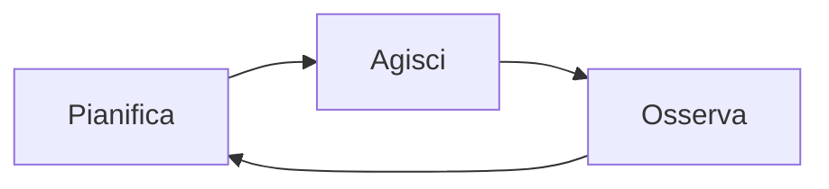
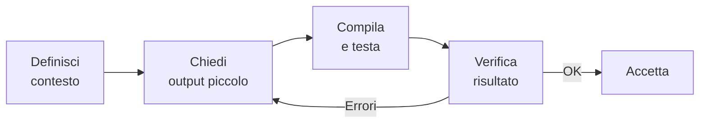
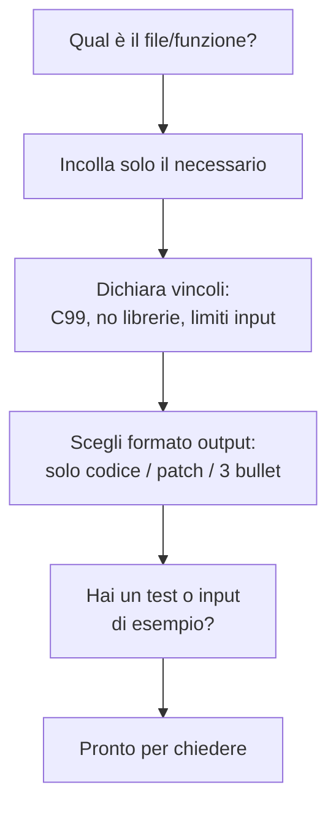

# Rispondi al sondaggio

Scansiona il QR code con il telefono

oppure

vai su slido.com e inserisci il codice:

## 1468 331

::right::


<!-- https://wall.sli.do/event/4JqN2FQ25AgprK61sixSzx?section=935314ea-1825-4ca1-bd24-50111172a8c6&integration=shared-present-mode&utm_source=slidoadmin -->

---

# Terminologia

Quale è il significato di questi termini?

| Termine | Definizione |
| --- | --- |
| Modello | ? |
| Contesto | ? |
| Prompt | ? |
| Agent | ? |

---

# Terminologia — Tabella completa

| Termine | Definizione |
| --- | --- |
| Modello | Rete neurale addestrata a prevedere il token successivo. |
| Contesto | Finestra limitata di testo che guida la risposta del modello. |
| Prompt | Istruzioni testuali usate per ottenere un comportamento desiderato. |
| Agent | Sistema che combina il modello con strumenti esterni e loop di ragionamento. |

---
layout: figure
figureUrl: /images/AI_venn.png
figureCaption: "Source: Wikipedia - AI, ML, DL, LLM relationship"

---

---

# Cos'è un LLM

**Large Language Model** (LLM): modello linguistico di grandi dimensioni basato su reti neurali.

## Caratteristiche principali

- Miliardi di parametri (pesi neurali)
- Addestrato su enormi quantità di testo da Internet
- Capace di comprendere e generare linguaggio naturale
- Capace di generare codice in molti linguaggi di programmazione

## Esempi

GPT-4, Claude, Gemini, Llama, DeepSeek

---
layout: two-cols

---

# LLM come strumenti probabilistici

## Esempio

Input: `"Il sole sorge a..."`

- `"est"` → 85%
- `"oriente"` → 10%
- `"ovest"` → 2%

::right::

## Concetto fondamentale

Gli LLM **non comprendono** il linguaggio come gli umani.

Sono modelli statistici che predicono la sequenza di parole più probabile.

## Come funziona la predizione

- Dato un contesto (prompt), il modello calcola la probabilità di ogni possibile token successivo
- Sceglie il token con probabilità più alta (o campiona dalla distribuzione)
- Ripete il processo per generare testo completo

---

# Implicazioni della natura probabilistica

## Vantaggi

- Output fluido e naturale
- Creatività e variabilità nelle risposte
- Capacità di gestire input imperfetti

## Limiti

- **Allucinazioni**: generazione di informazioni false ma plausibili
- **Inconsistenza**: output diversi per stesso input
- **Mancanza di ragionamento logico** vero
- **Nessuna garanzia** di correttezza

## Regola d'oro

**Valida sempre l'output** - compila, testa, verifica la logica del codice generato

---

# Temperature e casualità

Gli LLM permettono di controllare la casualità dell'output tramite il parametro **temperature**.

## Temperature bassa (0.0 - 0.3)

- Output deterministico e prevedibile
- Sceglie sempre il token più probabile
- **Uso**: codice, traduzioni, task tecnici

## Temperature media (0.5 - 0.7)

- Bilanciamento tra prevedibilità e creatività
- **Uso**: scrittura generale, assistenza

## Temperature alta (0.8 - 1.0+)

- Output creativo e vario
- Maggiore casualità nella selezione
- **Uso**: brainstorming, scrittura creativa

---

# Temperature: effetto sulla distribuzione

Prompt: `"Il sole sorge a..."` — come cambia la distribuzione dei token al variare della temperature.

| Token | Temp 0.1 | Temp 0.7 | Temp 1.2 |
| ------- | ---------- | ---------- | ---------- |
| est | 95 % | 55 % | 30 % |
| oriente | 4 % | 20 % | 22 % |
| mattina | 1 % | 12 % | 18 % |
| ovest | 0 % | 8 % | 16 % |
| alba | 0 % | 5 % | 14 % |

- **Bassa**: distribuzione concentrata, scelta quasi deterministica
- **Alta**: distribuzione più uniforme, maggiore variabilità

---

# Context window: concetti base

## Cos'è il Context Window

Quantità massima di testo che un LLM può "vedere" contemporaneamente (input + output).

È come la **memoria a breve termine** del modello.

## Misurazione in token

Il context window si misura in **token**, non in parole:

- 1 token ≈ 0.75 parole in inglese
- 1 token ≈ 0.5-0.7 parole in italiano

Esempio: `"printf(\"Hello\");"` = circa 5-6 token

---

# Context window: limiti pratici

## Implicazioni pratiche per lo sviluppo

- **Conversazioni lunghe** "dimenticano" l'inizio
- **Documenti troppo lunghi** vanno divisi in parti
- **Necessità di riassumere** periodicamente il contesto
- **File di codice grandi** potrebbero non entrare completamente
- Strategia: fornire solo il codice rilevante al task corrente

---
layout: figure-side
figureUrl: /images/context-window-llm.svg
figureCaption: "Schema semplificato del context window di un LLM"
zoom: 0.9

---

# Context window di un LLM

La **context window** e la memoria a breve termine del modello:

- Contiene prompt, cronologia recente e risposta in generazione
- Ha una capienza massima misurata in token
- Quando il limite e superato, le parti piu vecchie escono dalla finestra

## Impatto pratico

- Prompt lunghi riducono lo spazio per l'output
- Meglio inviare solo il codice rilevante
- Utile riassumere periodicamente il contesto

---

# Cos'è una Chat AI

Una **Chat AI** (o chatbot AI) è un'interfaccia conversazionale che permette di interagire con un LLM tramite dialogo in linguaggio naturale.

## Componenti principali

- **LLM sottostante**: il modello che genera risposte
- **Interfaccia utente**: dove si scrive e si legge
- **Memoria conversazionale**: mantiene il contesto del dialogo
- **System prompt**: istruzioni che definiscono il comportamento

## Esempi

ChatGPT, Claude, Gemini, Perplexity, GitHub Copilot Chat

---

# Cos'è un AI Agent

Un **AI Agent** è un sistema AI più avanzato che può pianificare, agire e osservare in un loop continuo:



- Usare strumenti esterni (API, database, esecuzione codice)
- Prendere decisioni autonome
- Eseguire task complessi multi-step

## Esempio pratico

Sistema che cerca informazioni su web, legge documenti, scrive un report e lo invia via email.

---

# Chat AI vs AI Agent: differenze

## Confronto delle caratteristiche

| **Componente** | **Chat AI** | **AI Agent** |
| --- | --- | --- |
| Interazione | Risponde a domande | Esegue azioni |
| Autonomia | Limitata | Elevata |
| Strumenti | Solo LLM | LLM + tool esterni |
| Complessità | Singolo scambio | Multi-step planning |

## Quando usare cosa

- **Chat AI**: per spiegazioni, suggerimenti, completamento codice
- **AI Agent**: per task complessi che richiedono più passi e uso di strumenti

---
layout: figure-side
figureUrl: /images/lmstudio1.png
figureCaption: "LM Studio: eseguire LLM in locale"

---

# LM Studio: eseguire LLM in locale (DEMO)

LM Studio permette di scaricare ed eseguire modelli LLM sul proprio computer.

**Vantaggi**: privacy, nessun costo API, lavoro offline

## Come provarlo

1. Scarica da lmstudio.ai
2. Cerca un modello (es. Llama, Mistral)
3. Scarica e avvia una chat locale

---

# Privacy: perché un LLM locale è vantaggioso

- Prompt e codice restano sul tuo computer: minore rischio di esposizione di dati sensibili
- Nessun invio obbligato a servizi cloud di terze parti
- Maggior controllo su log, conservazione dati e accessi in laboratorio o in azienda
- Più facile rispettare policy interne e vincoli di conformità

## Nota pratica

- Locale non significa "sicuro di default": servono comunque backup, cifratura disco e controllo accessi

---

# Perché usare agent AI nello sviluppo C

- Ridurre tempo di boilerplate (init, parsing, test) mantenendo focus sulla logica
- Ottenere spiegazioni rapide di warning e bug prima del debug manuale
- Esplorare alternative di design senza riscrivere tutto a mano
- Mantenere coerenza di stile e naming in team

---

# GitHub Copilot in breve

- Suggerimenti inline mentre si scrive in CLion (C, CMake, markdown)
- Copilot Chat per spiegazioni, refactoring, generazione test e fix mirati
- Non esegue il codice: serve sempre compilare/testare e fare review umana
- Può proporre codice non sicuro o incompleto: verificare input, error handling, limiti

---

# Prerequisiti

- Conoscenze di base del C (tipi, funzioni, array, puntatori semplici)
- Esperienza iniziale con CLion: creazione progetto, build, run, debugger
- Ambiente pronto con compilatore C (gcc/clang) e CLion installato

---

# Setup dell'ambiente: CLion + LM Studio

Per usare un modello locale con **LM Studio** in CLion, configura **AI Assistant** con l'API OpenAI-compatible esposta dal server locale.

- LM Studio espone modelli locali (es. Llama) come endpoint compatibile OpenAI
- Integrabile nativamente in CLion tramite **AI Assistant**
- Tutto gira in locale: massima privacy, nessun dato inviato al cloud

> Ref: [JetBrains AI Assistant – Custom Models](https://www.jetbrains.com/help/ai-assistant/use-custom-models.html)

---

# Setup LM Studio

- Avvia LM Studio > tab **Developer** > carica un modello (**Discover** → Download → Load)
- Clic **Start Server** (default: `http://localhost:1234/v1`; annota la porta se cambia)
- Testa il server dal terminale:

```bash
curl http://localhost:1234/v1/models
```

- La risposta JSON elenca i modelli caricati e pronti

---

# Config CLion AI Assistant

- CLion > **Settings** (`Cmd+,`) > **Tools › AI Assistant**
- **Third-party AI providers** › seleziona **LM Studio**
- **Base URL**: `http://localhost:1234/v1` (aggiungi `/v1` se mancante)
- **Model**: nome del modello dal server (es. `llama-3.1-8b`)
- No API Key richiesta — inserisci `not-needed`
- Clic **Test Connection** › Apply

---

# Uso in CLion con LM Studio

- **Chat AI**: `Alt+Shift+A` oppure sidebar AI → chiedi codice, spiegazioni, debug
- **Completions inline**: scrivi codice, l'AI suggerisce completamenti (accetta con `Tab`)
- **Context-aware**: analizza file e repository per risposte più precise

```text
LM Studio → CLion
├── Load model → Start Server (localhost:1234)
├── Settings > AI > LM Studio > URL + Test Connection
├── Usa: Chat (Alt+Shift+A), suggerimenti inline
└── Verifica: curl http://localhost:1234/v1/models
```

---

# Best Practices (LM Studio locale)

- **Modello consigliato**: formato GGUF con quantizzazione Q4/Q5, 7–13B parametri (4–8 GB di VRAM)
- **GPU**: abilita `nGPU layers` in LM Studio al massimo per il tuo hardware

> **GGUF**: formato compatto per modelli quantizzati, eseguibili su hardware consumer.  
> **VRAM**: memoria dedicata della GPU, necessaria per caricare il modello.

- **Privacy**: tutto locale e offline, nessun dato trasmesso
- **Licenza AI Assistant**: prova gratuita 30 gg; verifica student pack JetBrains
- Punto di partenza consigliato: **Llama 3.1 8B** (equilibrio velocità/qualità)

---

# Strumenti di lavoro

- CLion con toolchain C configurata
- Terminale per compilare ed eseguire
- Assistente AI testuale (es. Copilot Chat) integrato nell'IDE o nel browser
- Risorse progetto: repository, task tracker, documentazione

---

# Uso responsabile e limiti

- Verificare sempre il codice generato: compilazione, test, lettura manuale
- Non condividere dati sensibili nei prompt
- Citare la fonte AI quando si riutilizzano frammenti significativi
- Preferire piccoli passi iterativi per mantenere il controllo
- Conservare decisioni e motivazioni nei messaggi di commit

---

# Flusso di lavoro assistito (pattern)



- Definisci il contesto: obiettivo, vincoli, file coinvolti
- Chiedi un output piccolo e verificabile
- Esegui e osserva errori o warning
- Condividi log e snippet minimi nell'IDE/chat
- Itera fino a un risultato compilabile e leggibile

---

# Strutturare i prompt

- Contesto: cosa fa il programma, vincoli (C99, senza librerie extra)
- Compito: cosa vuoi ottenere (funzione, test, refactoring)
- Vincoli: lunghezza, stile, interfacce esistenti
- Output: formato atteso (solo codice, spiegazione breve, passi)

---

# Prompt di esempio (generazione)

Testo da dare all'assistente:

```text
Ho un programma C su CLion. Scrivi una funzione C99 che calcola la media di un array di int.
Non usare librerie extra. Mantieni i parametri const ove possibile. Aggiungi un breve commento.
Restituisci solo il codice della funzione.
```

---

# Esempio di codice generato

```c
#include <stddef.h>

double mean_ints(const int *values, size_t count) {
    if (values == NULL || count == 0) {
        return 0.0; // defend against invalid input
    }

    long sum = 0;
    for (size_t i = 0; i < count; ++i) {
        sum += values[i];
    }

    return (double)sum / (double)count;
}
```

---

# Panoramica e primo contatto

## Obiettivi

- Ruolo dell'AI nello sviluppo C: suggerimenti, non magia
- Setup: CLion + toolchain C (gcc/clang) + Copilot Chat

## Rischi da conoscere subito

- Accettare codice senza verifiche
- Prompt vaghi → output inutili
- Dipendenza dall'assistente per concetti base

## Metriche di successo

- Compila dopo piccole correzioni — patch piccole e leggibili

---

# Mini esercizio (CLion)

1. Apri Copilot Chat in CLion
2. Chiedi: *"Spiega in 3 bullet cosa fa un compilatore C"*
3. Verifica sintesi e chiarezza
4. Nota come risponde a prompt brevi

---

# Connection: Teach-back

In coppia, spiega al compagno in 30 secondi:

- **Cosè un token?**
- **Cos cambia tra temperature 0.1 e 0.9?**

⏱️ 2 minuti totali, poi confronto rapido

---

# Tipi di assistenti AI

| Tipo | Come funziona | Esempio |
| ------ | -------------- | ---------- |
| Inline | Completa token mentre scrivi | Suggerimento grigio in CLion |
| Chat | Rispondi a domande su selezione di codice | Copilot Chat |
| Agent | Legge file, esegue test, propone patch | Copilot Agent mode |

## Quando **non** usarlo

- Codice con dati sensibili
- Parti del progetto non comprese a fondo
- Urgenze senza tempo per verifiche

---

# Mini workflow (CLion)

1. Scrivi un commento che descrive la funzione desiderata
2. Genera con Copilot, accetta o rigenera
3. Compila subito e osserva warning
4. Salva i prompt efficaci in un file riutilizzabile

---

# Esercizio (CLion)

1. Chiedi a Copilot: *"Genera funzione C che somma array di int e gestisce null"*
2. Compila e misura quanto devi correggere
3. Aggiorna il prompt per ridurre le correzioni
4. Confronta il tuo risultato con il compagno

⏱️ 15 minuti

---

# Connection: Prompt Buono vs Cattivo (Miro)

Guarda questi 2 prompt. Quale funziona meglio? Vota su Miro!

**Prompt A**: *"Scrivi codice C"*

**Prompt B**: *"Scrivi funzione C99 che trova il massimo in un array di int. Gestisci array vuoto. Solo codice con breve commento."*

⏱️ 3 minuti — poi discussione

---

# Antipattern di prompt

- ❌ Troppo generici → output inutilizzabile
- ❌ Richieste doppie o contraddittorie
- ❌ Incollare troppo codice irrilevante

## Refinement iterativo

1. Chiedi versione breve
2. Aggiungi vincoli (C99, niente allocazioni dinamiche)
3. Chiedi solo codice finale

---

# Template pronti

## Generazione funzione

```text
Contesto: programma C per gestione array di int.
Compito: scrivi funzione C99 che trova il massimo.
Vincoli: niente librerie extra, gestisci array vuoto.
Output: solo codice della funzione, con breve commento.
```

## Debug

```text
Ho questo warning di clang: ...
Ecco la funzione minima: ...
Spiega la causa probabile e proponi una patch minima.
Restituisci solo la funzione corretta.
```

---

# Esercizio: Prompt Duel (CLion)

In coppia, stesso task: *"funzione C che conta le occorrenze di un valore in un array"*

1. Ognuno scrive il proprio prompt
2. Genera con Copilot
3. Confrontate: chi ha ottenuto codice migliore?
4. Discutete le differenze nei prompt

⏱️ 15 minuti

---

# Connection: Quiz veloce (Miro)

Rispondi su Miro — quale template useresti per:

1. Generare una funzione di ordinamento? → **Template ___**
2. Capire un warning di clang? → **Template ___**
3. Ottenere test per una funzione? → **Template ___**

⏱️ 3 minuti

---

# Checklist prima di chiedere all'AI



---

# Esercizio pratico (CLion)

Metti in pratica la checklist:

1. Scegli un task: *"funzione C che inverte un array in-place"*
2. Compila la checklist mentalmente
3. Scrivi il prompt e genera con Copilot
4. Compila, testa, correggi

⏱️ 15 minuti

---

# Riepilogo Lezione 1

- Fondamenti di AI, ML, Deep Learning
- Architettura Transformer e LLM moderni
- Natura probabilistica degli LLM e relative implicazioni
- Differenza tra Chat AI e AI Agent
- Basi per strutturare prompt efficaci
