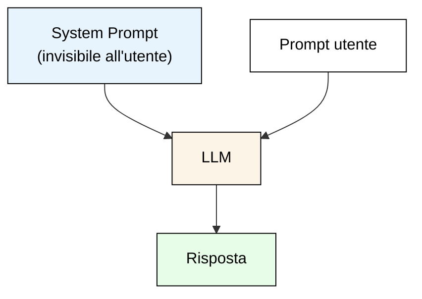
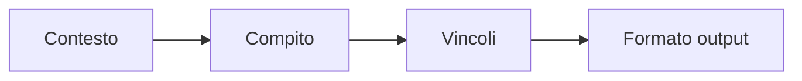
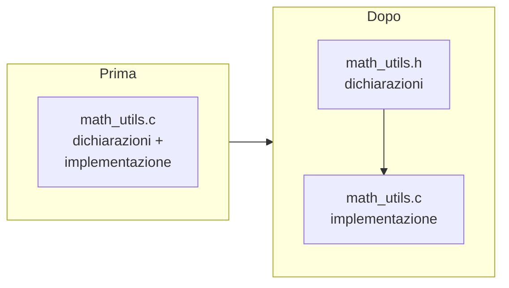

# Programmazione assistita dall'Intelligenza Artificiale

## Lezioni 2 - 3: Pratica con GitHub Copilot

Ing. Giancarlo Degani

---

---

# Esercizio: Costruisci il Tuo Prompt

Prova questi esercizi su un chatbot (locale o online):

## Livello 1 – Base

> Scrivi un prompt che chieda di spiegare la differenza tra `=` e `==` in C

## Livello 2 – Specifico

> Scrivi un prompt che chieda di generare una funzione C per contare quante volte un carattere appare in una stringa

## Livello 3 – Avanzato

> Riscrivi questo prompt vago in modo efficace:
> "Fai una cosa con gli array in C"

**Suggerimento**: applica i tre principi (chiarezza, specificità, contesto) e specifica il formato di output.

---

# Prompt efficaci = CRISPE

- **C**larity (Chiarezza)
- **R**ole (Ruolo)  
- **I**nstructions (Istruzioni)
- **S**teps (Passi)
- **P**arameters (Parametri)
- **E**xpectations (Aspettative)

---

# Template - CRISPE Prompt

- Ruolo: Sei un [ESPERTO: insegnante/developer/analista]
- Obiettivo: [COSA FARE]
- Istruzioni: [DETTAGLI]
- Passi: 1. [Passo1] 2. [Passo2]
- Parametri: [Limiti: lunghezza, tono, formato]
- Output: [JSON/lista/tabella]

## Esempio

```text
Ruolo: Insegnante di informatica per diplomati
Obiettivo: Spiega cos'è un LLM
Istruzioni: Usa analogie semplici, evita matematica
Passi: 1. Definizione 2. Esempio quotidiano 3. Limiti
Output: 3 paragrafi numerati
```

---

# Prompt efficaci = CO-STAR

- **C**ontext (Contesto)
- **O**bjective (Obiettivo)  
- **S**tyle (Stile)
- **T**one (Tono)
- **A**udience (Pubblico)
- **R**esponse (Risposta strutturata)

---

# Template - CO-STAR Prompt

- Contesto: [Background]
- Obiettivo: [Cosa ottenere]
- Stile: [Formale/creativo/tecnico]
- Tono: [Amichevole/autoritario]
- Pubblico: [Livello: diplomati/esperti]
- Risposta: [Formato: elenco/JSON/paragrafi]

---
zoom: 1.4

---

# Esempio CO-STAR Prompt

```text
Contesto: Sei un assistente AI che aiuta studenti a capire 
concetti di informatica
Obiettivo: Spiega cos'è un LLM
Stile: Semplice e accessibile
Tono: Amichevole e incoraggiante
Pubblico: Studenti delle superiori
Risposta: 3 paragrafi numerati con esempi quotidiani
```

---
zoom: 1.4

---

# Esempio: Spiegazione Didattica

```text
CRISPE: 
Ruolo: Insegnante diplomati IT
Obiettivo: Spiega [CONCETTO]
Istruzioni: Analogie quotidiane, 3 esempi
Parametri: 300 parole max, italiano semplice
Output: 1. Definizione 2. Esempio1 3. Esempio2 4. Limiti

```

---
zoom: 1.4

---

# Esempio:  Coding Assistant

```text
COSTAR:
Contesto: Linguaggio Python
Obiettivo: Scrivi funzione [FUNZIONE]
Stile: PEP8 compliant
Tono: Commenti chiari
Risposta: Codice + test + docstring

```

---
zoom: 1.4

---

# Esempio: Analisi Testo

```text
RISE:
Ruolo: Analista dati
Input: [TESTO]
Passi: 1. Identifica temi 2. Sentiment 3. Keywords
Output: JSON strutturato

```

---
layout: two-cols

---

# Cos'è il System Prompt?

Il **system prompt** è un'istruzione nascosta che definisce il **comportamento** dell'assistente AI prima ancora che l'utente scriva qualcosa.

- Viene inviato **prima** del messaggio dell'utente
- Stabilisce ruolo, tono, vincoli e regole
- L'utente finale di solito non lo vede

::right::



---

# System Prompt: a cosa serve

## Utilità principali

- **Definire il ruolo**: "Sei un tutor di programmazione C per principianti"
- **Impostare il tono**: formale, informale, tecnico, didattico
- **Aggiungere vincoli**: "Rispondi solo in italiano", "Usa solo C99"
- **Guidare il formato**: "Rispondi con bullet point", "Includi sempre un esempio"
- **Limitare il perimetro**: "Non rispondere a domande fuori tema"

## Perché è importante

Senza system prompt, il modello risponde in modo generico. Con un system prompt ben scritto, le risposte diventano **coerenti**, **mirate** e **riutilizzabili**.

---
layout: two-cols

---

# Esempi di System Prompt

## Esempio 1: Tutor C

```text
Sei un tutor di programmazione C
per studenti principianti.
Rispondi sempre in italiano.
Usa solo C99 senza librerie esterne.
Ogni risposta deve includere
un esempio di codice compilabile.
Spiega il codice riga per riga.
```

::right::

<br>
<br>
<br>

## Esempio 2: Code reviewer

```text
Sei un revisore di codice C esperto.
Analizza il codice fornito e segnala:
- errori logici
- problemi di memoria
- violazioni dello standard C99
Rispondi in italiano con suggerimenti
concreti di correzione.
```

---
layout: two-cols

---

# Esempi di System Prompt

## Esempio 3: Assistente minimal

```text
Rispondi solo con codice C.
Nessuna spiegazione.
Nessun commento nel codice.
Se la richiesta non riguarda
il C, rispondi "Fuori tema".
```

::right::

<br>
<br>
<br>

## Esempio 4: Generatore di esercizi

```text
Sei un docente di programmazione C.
Genera esercizi di difficoltà
crescente per studenti ITS.
Ogni esercizio deve avere:
- descrizione del problema
- input e output attesi
- suggerimento (nascosto)
Usa solo concetti base del C.
```

---

# System Prompt: prova pratica

## Prova su LM Studio o qualsiasi chatbot

La maggior parte dei chatbot permette di impostare un system prompt nelle impostazioni della chat.

## Esercizio guidato

1. Apri un chatbot (LM Studio, ChatGPT, Claude...)
2. Imposta questo system prompt:

> "Sei un tutor di C per principianti. Rispondi in italiano. Ogni risposta include un esempio compilabile e una spiegazione passo-passo."

3. Chiedi: *"Come funziona un ciclo for?"*
4. Ora rimuovi il system prompt e rifai la stessa domanda
5. Confronta le due risposte: quale è più utile?

**Osservazione**: il system prompt rende le risposte più coerenti e adatte al contesto didattico.

---

# Avviare il server locale per CLion

## Perché serve il server

CLion si collega a LM Studio tramite un'API locale compatibile con OpenAI. Serve attivare il server integrato.

## Procedura

1. In LM Studio vai nella sezione **Developer** (icona `</>`)
2. Seleziona il modello **Llama-3.1-8B-Instruct-Q4_K_M** se non è già caricato
3. Clicca **Start Server** — di default parte su `http://localhost:1234`
4. Verifica dal terminale:

```bash
curl http://localhost:1234/v1/models
```

5. La risposta JSON deve elencare il modello caricato

> Annota la porta (1234) — servirà nella configurazione di CLion.

---

# Privacy: perché un LLM locale è vantaggioso

- Prompt e codice restano sul tuo computer: minore rischio di esposizione di dati sensibili
- Nessun invio obbligato a servizi cloud di terze parti
- Maggior controllo su log, conservazione dati e accessi in laboratorio o in azienda
- Più facile rispettare policy interne e vincoli di conformità

## Nota pratica

- Locale non significa "sicuro di default": servono comunque backup, cifratura disco e controllo accessi

---

# Perché usare agent AI nello sviluppo C

- Ridurre tempo di boilerplate (init, parsing, test) mantenendo focus sulla logica
- Ottenere spiegazioni rapide di warning e bug prima del debug manuale
- Esplorare alternative di design senza riscrivere tutto a mano
- Mantenere coerenza di stile e naming in team

---

# Creare un account GitHub

Per usare **GitHub Copilot** serve un account GitHub attivo.

## Passaggi

1. Vai su **github.com** e clicca **Sign up**
2. Inserisci email, password e username
3. Conferma l'email ricevuta
4. Attiva il piano **GitHub Copilot**:
   - Gratuito per studenti tramite **GitHub Education** (github.com/education)
   - Oppure prova gratuita 30 giorni con piano Pro

## GitHub Education (consigliato)

- Vai su **github.com/education** → **Join Global Campus**
- Usa la tua email istituzionale (es. @its...)
- Dopo l'approvazione, Copilot è incluso gratuitamente

---

# Installare GitHub Copilot in CLion

## Passaggi

1. Apri CLion → **Settings** (`Cmd+,` su Mac, `Ctrl+Alt+S` su Windows/Linux)
2. Vai su **Plugins** → tab **Marketplace**
3. Cerca **"GitHub Copilot"**
4. Clicca **Install** → **Restart IDE**

## Primo accesso

1. Dopo il riavvio, compare la notifica **"Sign in to GitHub"**
2. Clicca **Sign in** → si apre il browser
3. Autorizza l'accesso con il tuo account GitHub
4. Torna in CLion: compare il messaggio **"Copilot is ready"**

## Verifica

- Apri un file `.c` e inizia a scrivere: i suggerimenti appaiono in grigio
- Premi `Tab` per accettare, `Esc` per rifiutare

---

# Installare JetBrains AI Assistant in CLion

## Passaggi

1. Apri CLion → **Settings** → **Plugins** → **Marketplace**
2. Cerca **"AI Assistant"** (di JetBrains)
3. Clicca **Install** → **Restart IDE**

## Primo accesso

1. Dopo il riavvio, clicca sull'icona **AI** nella sidebar a destra
2. Effettua il login con il tuo account **JetBrains**
3. Se non hai un account, crealo su **account.jetbrains.com**

## Licenza

- Prova gratuita di **30 giorni** inclusa
- Studenti: verifica se il tuo **JetBrains Student Pack** include AI Assistant
- Dopo la prova, necessario un abbonamento a pagamento

---
layout: two-cols

---

# Copilot vs AI Assistant: quale usare?

| | **GitHub Copilot** | **AI Assistant** |
| --- | --- | --- |
| Produttore | GitHub/Microsoft | JetBrains |
| Completamento inline | Sì | Sì |
| Chat integrata | Sì | Sì |
| Modelli locali (LM Studio) | No | Sì |
| Costo studenti | Gratuito (Education) | Prova 30 gg |

::right::

## Consiglio pratico

- **Copilot**: ottimo per completamento e chat, gratis con GitHub Education
- **AI Assistant**: necessario per collegare **LM Studio** e modelli locali
- Si possono installare **entrambi** senza conflitti
- Nel corso useremo entrambi a seconda del contesto

---

# GitHub Copilot in breve

- Suggerimenti inline mentre si scrive in CLion (C, CMake, markdown)
- Copilot Chat per spiegazioni, refactoring, generazione test e fix mirati
- Non esegue il codice: serve sempre compilare/testare e fare review umana
- Può proporre codice non sicuro o incompleto: verificare input, error handling, limiti

---

# Prerequisiti

- Conoscenze di base del C (tipi, funzioni, array, puntatori semplici)
- Esperienza iniziale con CLion: creazione progetto, build, run, debugger
- Ambiente pronto con compilatore C (gcc/clang) e CLion installato

---

# Setup dell'ambiente: CLion + LM Studio

Per usare un modello locale con **LM Studio** in CLion, configura **AI Assistant** con l'API OpenAI-compatible esposta dal server locale.

- LM Studio espone modelli locali (es. Llama) come endpoint compatibile OpenAI
- Integrabile nativamente in CLion tramite **AI Assistant**
- Tutto gira in locale: massima privacy, nessun dato inviato al cloud

> Ref: [JetBrains AI Assistant – Custom Models](https://www.jetbrains.com/help/ai-assistant/use-custom-models.html)

---

# Setup LM Studio

- Avvia LM Studio > tab **Developer** > carica un modello (**Discover** → Download → Load)
- Clic **Start Server** (default: `http://localhost:1234/v1`; annota la porta se cambia)
- Testa il server dal terminale:

```bash
curl http://localhost:1234/v1/models
```

- La risposta JSON elenca i modelli caricati e pronti

---

# Config CLion AI Assistant

- CLion > **Settings** (`Cmd+,`) > **Tools › AI Assistant**
- **Third-party AI providers** › seleziona **LM Studio**
- **Base URL**: `http://localhost:1234/v1` (aggiungi `/v1` se mancante)
- **Model**: nome del modello dal server (es. `llama-3.1-8b`)
- No API Key richiesta — inserisci `not-needed`
- Clic **Test Connection** › Apply

---

# Uso in CLion con LM Studio

- **Chat AI**: `Alt+Shift+A` oppure sidebar AI → chiedi codice, spiegazioni, debug
- **Completions inline**: scrivi codice, l'AI suggerisce completamenti (accetta con `Tab`)
- **Context-aware**: analizza file e repository per risposte più precise

```text
LM Studio → CLion
├── Load model → Start Server (localhost:1234)
├── Settings > AI > LM Studio > URL + Test Connection
├── Usa: Chat (Alt+Shift+A), suggerimenti inline
└── Verifica: curl http://localhost:1234/v1/models
```

---

# Best Practices (LM Studio locale)

- **Modello consigliato**: formato GGUF con quantizzazione Q4/Q5, 7–13B parametri (4–8 GB di VRAM)
- **GPU**: abilita `nGPU layers` in LM Studio al massimo per il tuo hardware

> **GGUF**: formato compatto per modelli quantizzati, eseguibili su hardware consumer.  
> **VRAM**: memoria dedicata della GPU, necessaria per caricare il modello.

- **Privacy**: tutto locale e offline, nessun dato trasmesso
- **Licenza AI Assistant**: prova gratuita 30 gg; verifica student pack JetBrains
- Punto di partenza consigliato: **Llama 3.1 8B** (equilibrio velocità/qualità)

---

# Riepilogo Lezione 1

- Fondamenti di AI, ML, Deep Learning
- Architettura Transformer e LLM moderni
- Natura probabilistica degli LLM e relative implicazioni
- Differenza tra Chat AI e AI Agent
- Basi per strutturare prompt efficaci

---

# 🎯 Attività di apertura (Miro)

Scrivi su Miro:

- 🟢 **Una cosa che ricordo dalla Lezione 1**
- 🟡 **Una cosa che vorrei approfondire oggi**

⏱️ 3 minuti — poi confronto rapido

---

# Configurare CLion con GitHub Copilot

- CLion > Settings/Preferences > Plugins > Marketplace: installa "GitHub Copilot" e "GitHub Copilot Chat"
- Riavvia CLion, poi login GitHub quando richiesto (Authorize nel browser)
- Settings > Tools > GitHub Copilot: abilita completamenti inline e scegli la keymap preferita
- Settings > Tools > GitHub Copilot Chat: abilita la chat e assegna uno shortcut
- Facoltativo: limita telemetria e riduci suggerimenti per file di grandi dimensioni

---

# Copilot in CLion: uso quotidiano

- Inline: scrivi il commento della funzione, attendi il suggerimento grigio, accetta o rigenera
- Chat: seleziona un blocco e chiedi refactoring, test, spiegazione warning
- Code actions: tasto destro > Copilot per documentazione o correzioni
- Mantieni le richieste brevi e locali: un file o una funzione alla volta

---

# Prompt efficaci: riepilogo dalla Lezione 1

- Specifica standard e vincoli: "usa C99, niente librerie esterne, input validato"
- Fornisci interfacce: firme funzioni, strutture dati attese, range input
- Chiedi output in un formato: "solo codice", "spiega in 3 bullet", "mostra patch"



---

# Strategie di verifica

- Compila sempre dopo ogni suggerimento accettato
- Aggiungi assert e controlli su input/null pointer prima di fidarti
- Confronta la patch proposta con un diff piccolo e leggibile
- Esegui test su casi limite (array vuoti, overflow, indici out-of-range)

---

# Esempi di richieste veloci

- "Scrivi una funzione C99 che normalizza un valore int in [0,1], senza float"
- "Spiega questo warning di clang e proponi fix minimale"
- "Genera test per questa funzione che calcola mediana, includi casi dispari/pari"
- "Separa questo file in .h/.c mantenendo le firme"

---

# Debug assistito

- Fornisci messaggi di errore completi (compilatore o runtime)
- Invia solo la funzione o il file minimo riproducibile
- Chiedi spiegazioni passo-passo: cosa significa l'errore, dove guardare

Esempio di prompt per un `segmentation fault`:

```text
Ho un segmentation fault in questa funzione C. Ecco la funzione e l'input che lo causa.
Spiega la causa probabile e proponi una correzione minimale.
```

---

# Snippet per il debug

```c
#include <stdio.h>

int read_value(const int *buffer, size_t length, size_t index) {
    if (buffer == NULL || index >= length) {
        return -1; // invalid access avoided
    }
    return buffer[index];
}

int main(void) {
    int data[] = {3, 5, 7};
    printf("%d\n", read_value(data, 3, 5));
    return 0;
}
```

- L'assistente può evidenziare l'accesso fuori limite (`index >= length`)
- Dopo la correzione, ricompila e riesegui il test

---

# Snippet: clamp e normalizza

```c
#include <stddef.h>

int clamp_int(int value, int min, int max) {
    if (min > max) {
        return value; // invalid bounds, return as-is
    }
    if (value < min) {
        return min;
    }
    if (value > max) {
        return max;
    }
    return value;
}

double normalize_int(int value, int min, int max) {
    if (min >= max) {
        return 0.0; // avoid divide-by-zero
    }

    int clamped = clamp_int(value, min, max);
    return (double)(clamped - min) / (double)(max - min);
}
```

- Usabile come esempio di output generato, con controlli minimi
- Valuta con l'assistente varianti senza double se richiesto

---

# Refactoring con AI

- Chiedi di rinominare funzioni/variabili mantenendo l'API
- Richiedi separazione in file `.c` e `.h` indicando le firme
- Domanda tipica: "Proponi un refactoring che migliori la leggibilità senza cambiare il comportamento"
- Verifica con diff ridotti e compilazione

---

# Documentazione e commenti

- Domanda tipica: "Aggiungi commenti essenziali e brevi a questo file"
- Mantieni commenti in inglese per il codice C del corso
- Evita commenti ridondanti; privilegia il perché rispetto al cosa

---

# Testing e validazione

- Genera casi di test piccoli e mirati (input validi e edge case)
- Automatizza dove possibile con script di build/test
- Confronta l'output atteso con quello osservato; condividi le differenze nell'IDE

---

# Generazione C: I/O di base

## Connection: Hello Copilot (CLion)

Crea un progetto C vuoto in CLion e prova:

1. Scrivi `// function that reads an integer safely`
2. Attendi il suggerimento grigio di Copilot
3. Accetta o rigenera

⏱️ 5 minuti

---

# Generazione C: I/O di base (risultato atteso)

```c
#include <stdio.h>

int read_int_safe(void) {
    int value = 0;
    if (scanf("%d", &value) != 1) {
        return 0; // fallback if input fails
    }
    return value;
}
```

- Esercizio: chiedi all'assistente di aggiungere controllo su range

---

# Generazione C: ricerca lineare

```c
#include <stddef.h>

int find_value(const int *values, size_t count, int target) {
    if (values == NULL) {
        return -1; // invalid input
    }
    for (size_t i = 0; i < count; ++i) {
        if (values[i] == target) {
            return (int)i;
        }
    }
    return -1; // not found
}
```

- Prompt l'assistente per varianti con early exit

---

# Generazione C: min/max in una passata

```c
#include <stddef.h>

int range_min_max(const int *values, size_t count, int *out_min, int *out_max) {
    if (values == NULL || out_min == NULL || out_max == NULL || count == 0) {
        return -1; // invalid input
    }
    int min_v = values[0];
    int max_v = values[0];
    for (size_t i = 1; i < count; ++i) {
        if (values[i] < min_v) min_v = values[i];
        if (values[i] > max_v) max_v = values[i];
    }
    *out_min = min_v;
    *out_max = max_v;
    return 0;
}
```

- Esercizio: chiedi test per array vuoti e valori ripetuti

---

# Generazione C: strutture semplici

```c
#include <stddef.h>

typedef struct {
    const char *name;
    int value;
} Item;

int find_item(const Item *items, size_t count, const char *name) {
    if (items == NULL || name == NULL) {
        return -1;
    }
    for (size_t i = 0; i < count; ++i) {
        const char *n = items[i].name;
        if (n != NULL && n[0] == name[0]) {
            return (int)i; // naive match on first char
        }
    }
    return -1;
}
```

- Chiedi all'assistente di migliorare il confronto stringhe

---

# Gestione errori

- Sempre controllare puntatori null
- Restituire codici di errore chiari (0, -1)
- Commentare i casi eccezionali in inglese

---

# Warning comuni

## Connection: Bug Hunt (Miro)

Trova il bug in ciascun snippet! Scrivi la risposta su Miro.

```c
// Snippet 1
int a = 3.14;  // quale warning?

// Snippet 2
for (int i = 0; i < -1u; i++) {}  // perché loop infinito?

// Snippet 3
int x; printf("%d", x);  // cosa stampa?
```

⏱️ 5 minuti — poi verifica con Copilot

---

# Warning comuni: tipi

- Implicit conversion: perdita di precisione
- Signed/unsigned mismatch in confronti
- Variabili non inizializzate

---

# Debug: ordine di lettura

- Leggi l'errore intero, non solo la prima riga
- Identifica file e riga coinvolta
- Chiedi all'assistente spiegazione del warning esatto

---

# Debug: schema di prompt

```text
Ho questo warning: ...
Ecco la funzione minima: ...
Che cosa significa e come correggerlo con minima modifica?
Restituisci solo la funzione corretta.
```

---

# Esempio di correzione

```c
int divide(int num, int den) {
    if (den == 0) {
        return 0; // avoid divide-by-zero
    }
    return num / den;
}
```

- Prompt: chiedi all'assistente di gestire overflow e remainder

---

# Tracciare gli input

- Riproduci il bug con un input minimo
- Aggiungi printf o log temporanei
- Rimuovi il logging dopo la fix

---

# Domande utili da fare

- "Che cosa succede se den è zero?"
- "Ci sono indici fuori limite?"
- "Serve cast esplicito qui?"

---

# Esercizio: Debug Race (CLion)

In coppia, stessa funzione con bug nascosto:

```c
int sum_positive(const int *arr, int count) {
    int sum;
    for (int i = 0; i <= count; i++) {
        if (arr[i] > 0) sum += arr[i];
    }
    return sum;
}
```

1. **Giocatore A**: trova i bug senza AI
2. **Giocatore B**: usa Copilot Chat
3. Chi corregge prima? Confrontate i risultati

⏱️ 10 minuti

---

# Refactoring: obiettivi

- Leggibilità senza cambiare comportamento
- Ridurre duplicazione
- Separare interfaccia (.h) da implementazione (.c)



---

# Separare header e sorgente

```c
// math_utils.h
#ifndef MATH_UTILS_H
#define MATH_UTILS_H

int clamp_int(int value, int min, int max);

#endif
```

```c
// math_utils.c
#include "math_utils.h"

int clamp_int(int value, int min, int max) {
    if (min > max) {
        return value;
    }
    if (value < min) return min;
    if (value > max) return max;
    return value;
}
```

- Chiedi all'assistente di creare test separati

---

# Rinominare in sicurezza

- Chiedi una lista di nomi alternativi
- Sostituisci manualmente o con assistente
- Ricompila dopo ogni rinomina

---

# Commenti essenziali

- Spiega il perché, non il cosa
- Mantieni commenti brevi in inglese
- Rimuovi commenti obsoleti dopo il refactoring

---

# Esercizio: Refactoring Sprint (CLion)

Sfida a tempo!

1. Prendi la funzione `find_value`
2. Chiedi a Copilot di estrarre controlli in funzione dedicata
3. Separa in `.h` e `.c`
4. Verifica che compili senza warning

⏱️ 10 minuti — chi finisce per primo?

---

# Test: checklist

- Casi nominali e casi limite
- Input null, array vuoti, indici oltre range
- Confronto output atteso vs ottenuto

---

# Test manuali con assert

```c
#include <assert.h>

void test_find_value(void) {
    int data[] = {1, 2, 3};
    assert(find_value(data, 3, 2) == 1);
    assert(find_value(data, 3, 5) == -1);
}

int main(void) {
    test_find_value();
    return 0;
}
```

---

# Test tabellari: esempio visivo

| Input | Funzione | Expected | Actual | Pass? |
| --- | --- | --- | --- | --- |
| `{1,2,3}`, target=2 | `find_value` | `1` | `1` | ✅ |
| `NULL`, target=1 | `find_value` | `-1` | `-1` | ✅ |
| `{}`, count=0, target=1 | `find_value` | `-1` | ? | ❓ |
| `{5,5,5}`, min/max | `range_min_max` | `5/5` | ? | ❓ |

Chiedi all'assistente di generare il codice di test per ogni riga.

---

# Gestione degli errori

- Testare percorsi negativi (null pointer, count zero)
- Verificare codici di ritorno coerenti
- Documentare cosa succede su input non valido

---

# Valutare la copertura

- Non serve misurare numericamente, ma copri rami principali
- Usa input piccoli e riproducibili
- Aggiorna i test dopo refactoring

---

# Esercizio: Test Factory (CLion)

Sfida: genera il maggior numero di **test validi** per `range_min_max` in 5 minuti!

- Includi array con tutti valori uguali
- Prova array con un solo elemento
- Testa con `NULL` e count=0
- Confronta con una versione proposta dall'assistente

⏱️ 5 minuti — chi produce più test che passano?

---

# Workflow in team con AI

## Connection: Prompt Gallery (Miro)

Condividi su Miro il tuo **miglior prompt** usato finora.

Vota con 👍 i prompt più efficaci degli altri!

⏱️ 5 minuti

---

# Lavorare in team con AI

- Condividi prompt efficaci e risultati
- Definisci standard di stile e naming
- Fai review reciproca delle proposte AI

---

# Pair programming con AI

- Scrivi tu la struttura, fai completare dettagli
- Chiedi spiegazioni brevi delle scelte
- Interrompi e riparti se l'output diventa rumoroso
- L'assistente dimentica se il prompt è lungo: riassumi!

---

# Esercizio di gruppo (CLion)

Progetto collaborativo:

1. Dividi un problema in funzioni (es. "programma che legge N interi, trova min/max, e stampa statistiche")
2. Assegna a ciascuno un prompt per generare la propria parte
3. Integra e testa insieme in CLion
4. Verifica con la checklist:
   - ☐ Codice compila?
   - ☐ Input invalidi gestiti?
   - ☐ Commenti essenziali e aggiornati?

⏱️ 20 minuti

---

# 🎫 Biglietto d'uscita — Lezione 2 (Miro)

Scrivi su Miro un post-it con:

- Il mio prompt più efficace di oggi
- Cosa mi ha sorpreso dell'AI

---

# Sfida aperta di laboratorio (CLion)

## Il tuo mini-progetto

Costruisci un programma C con:

- ☐ Almeno **2 funzioni** in file separati (.h/.c)
- ☐ Almeno **3 test** con assert
- ☐ Gestione di **input non validi**
- ☐ Un breve **README** con: funzioni, test eseguiti, problemi aperti

Usa l'AI come vuoi, ma **documenta ogni interazione** nelle note!

⏱️ 50 minuti

---

# Suggerimenti per il laboratorio

Idee di progetto (scegli una):

1. **Calcolatore statistiche**: leggi N interi, calcola media, min, max
2. **Gestore rubrica**: array di struct con nome e valore, cerca per nome
3. **Validatore input**: leggi stringhe numeriche e verifica formato

## Passi consigliati

1. Crea progetto e `main.c` — verifica build
2. Implementa funzioni con Copilot
3. Estrai header e separa file
4. Scrivi test con assert
5. Redigi README con l'aiuto dell'assistente

---

# Teach-back (15 min)

Prima del test, consolidamento in coppia:

1. **Insegna al compagno** un concetto chiave del corso (2 min ciascuno)
2. **Scrivi su Miro** i 3 comandi/pattern più utili che hai scoperto
3. **Raccogli** i prompt e snippet riutilizzabili

⏱️ 15 minuti

---

# Test finale

## Regole

- Durata: **60 minuti**, individuale
- Puoi usare AI: chiarimenti e snippet
- Devi verificare compilazione e correttezza
- Indica nelle note dove hai usato l'assistente

## Strategia di tempo consigliata

- 10' lettura traccia e pianificazione
- 30' implementazione con piccoli test
- 20' verifica e pulizia

## Consegna

- Repository o archivio con codice e breve README

---

# Rubrica di valutazione

| Criterio | Peso |
| --- | --- |
| Corretta esecuzione dei requisiti | ⭐⭐⭐ |
| Gestione input non validi | ⭐⭐ |
| Chiarezza di codice e commenti | ⭐⭐ |
| Uso controllato dell'AI (tracciato) | ⭐ |

## Esempio di nota finale

- "Ho usato l'assistente per generare skeleton di `find_value`"
- "Ho aggiunto io controlli su null e test"
- "Warning risolto: signed/unsigned mismatch"

---

# FAQ - L'assistente sbaglia

- Prova un prompt più breve
- Chiedi di spiegare passo-passo
- Cambia vincoli (es. rimuovi malloc) e rigenera

---

# FAQ - Output troppo lungo

- Chiedi "solo codice"
- Specifica numero di righe o blocchi
- Separa la richiesta in due prompt

---

# FAQ - Codice non compila

- Incolla l'errore preciso nel prompt
- Chiedi una patch minima, non una riscrittura
- Verifica include e tipi mancanti

-

---

# Riepilogo Lezioni 2-3

- Configurazione pratica di Copilot in CLion
- Strategie di verifica e testing
- Workflow di debug assistito
- Refactoring e separazione header/sorgente
- Laboratorio guidato passo-passo
- Test finale per consolidare apprendimento

---

# Risorse consigliate

- Documentazione CLion per C
- Linee guida Copilot per uso sicuro
- I prompt salvati durante il corso

---

# 🎫 Biglietto d'uscita finale (Miro)

Scrivi su Miro:

- 🟢 **La cosa più utile che ho imparato nel corso**
- 🟡 **Come userò l'AI nel prossimo progetto**
- 🔴 **Un consiglio per chi inizia**

---

# Suggerimenti finali

- Pochi prompt, mirati e brevi
- Compila spesso, testa casi limite
- Mantieni traccia di cosa hai accettato dall'assistente
