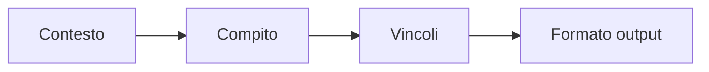
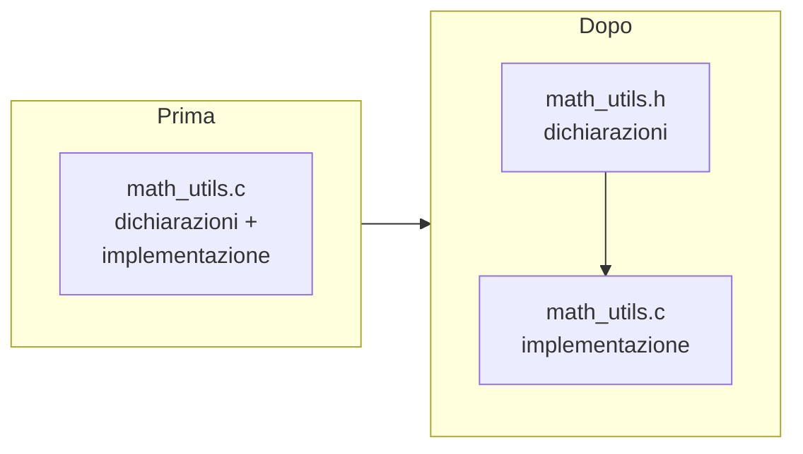

# Programmazione assistita dall'Intelligenza Artificiale

## Lezioni 2 - 3: Pratica con GitHub Copilot

Ing. Giancarlo Degani

---

# 🎯 Attività di apertura (Miro)

Scrivi su Miro:

- 🟢 **Una cosa che ricordo dalla Lezione 1**
- 🟡 **Una cosa che vorrei approfondire oggi**

⏱️ 3 minuti — poi confronto rapido

---

# Configurare CLion con GitHub Copilot

- CLion > Settings/Preferences > Plugins > Marketplace: installa "GitHub Copilot" e "GitHub Copilot Chat"
- Riavvia CLion, poi login GitHub quando richiesto (Authorize nel browser)
- Settings > Tools > GitHub Copilot: abilita completamenti inline e scegli la keymap preferita
- Settings > Tools > GitHub Copilot Chat: abilita la chat e assegna uno shortcut
- Facoltativo: limita telemetria e riduci suggerimenti per file di grandi dimensioni

---

# Copilot in CLion: uso quotidiano

- Inline: scrivi il commento della funzione, attendi il suggerimento grigio, accetta o rigenera
- Chat: seleziona un blocco e chiedi refactoring, test, spiegazione warning
- Code actions: tasto destro > Copilot per documentazione o correzioni
- Mantieni le richieste brevi e locali: un file o una funzione alla volta

---

# Prompt efficaci: riepilogo dalla Lezione 1

- Specifica standard e vincoli: "usa C99, niente librerie esterne, input validato"
- Fornisci interfacce: firme funzioni, strutture dati attese, range input
- Chiedi output in un formato: "solo codice", "spiega in 3 bullet", "mostra patch"



---

# Strategie di verifica

- Compila sempre dopo ogni suggerimento accettato
- Aggiungi assert e controlli su input/null pointer prima di fidarti
- Confronta la patch proposta con un diff piccolo e leggibile
- Esegui test su casi limite (array vuoti, overflow, indici out-of-range)

---

# Esempi di richieste veloci

- "Scrivi una funzione C99 che normalizza un valore int in [0,1], senza float"
- "Spiega questo warning di clang e proponi fix minimale"
- "Genera test per questa funzione che calcola mediana, includi casi dispari/pari"
- "Separa questo file in .h/.c mantenendo le firme"

---

# Debug assistito

- Fornisci messaggi di errore completi (compilatore o runtime)
- Invia solo la funzione o il file minimo riproducibile
- Chiedi spiegazioni passo-passo: cosa significa l'errore, dove guardare

Esempio di prompt per un `segmentation fault`:

```text
Ho un segmentation fault in questa funzione C. Ecco la funzione e l'input che lo causa.
Spiega la causa probabile e proponi una correzione minimale.
```

---

# Snippet per il debug

```c
#include <stdio.h>

int read_value(const int *buffer, size_t length, size_t index) {
    if (buffer == NULL || index >= length) {
        return -1; // invalid access avoided
    }
    return buffer[index];
}

int main(void) {
    int data[] = {3, 5, 7};
    printf("%d\n", read_value(data, 3, 5));
    return 0;
}
```

- L'assistente può evidenziare l'accesso fuori limite (`index >= length`)
- Dopo la correzione, ricompila e riesegui il test

---

# Snippet: clamp e normalizza

```c
#include <stddef.h>

int clamp_int(int value, int min, int max) {
    if (min > max) {
        return value; // invalid bounds, return as-is
    }
    if (value < min) {
        return min;
    }
    if (value > max) {
        return max;
    }
    return value;
}

double normalize_int(int value, int min, int max) {
    if (min >= max) {
        return 0.0; // avoid divide-by-zero
    }

    int clamped = clamp_int(value, min, max);
    return (double)(clamped - min) / (double)(max - min);
}
```

- Usabile come esempio di output generato, con controlli minimi
- Valuta con l'assistente varianti senza double se richiesto

---

# Refactoring con AI

- Chiedi di rinominare funzioni/variabili mantenendo l'API
- Richiedi separazione in file `.c` e `.h` indicando le firme
- Domanda tipica: "Proponi un refactoring che migliori la leggibilità senza cambiare il comportamento"
- Verifica con diff ridotti e compilazione

---

# Documentazione e commenti

- Domanda tipica: "Aggiungi commenti essenziali e brevi a questo file"
- Mantieni commenti in inglese per il codice C del corso
- Evita commenti ridondanti; privilegia il perché rispetto al cosa

---

# Testing e validazione

- Genera casi di test piccoli e mirati (input validi e edge case)
- Automatizza dove possibile con script di build/test
- Confronta l'output atteso con quello osservato; condividi le differenze nell'IDE

---

# Generazione C: I/O di base

## Connection: Hello Copilot (CLion)

Crea un progetto C vuoto in CLion e prova:

1. Scrivi `// function that reads an integer safely`
2. Attendi il suggerimento grigio di Copilot
3. Accetta o rigenera

⏱️ 5 minuti

---

# Generazione C: I/O di base (risultato atteso)

```c
#include <stdio.h>

int read_int_safe(void) {
    int value = 0;
    if (scanf("%d", &value) != 1) {
        return 0; // fallback if input fails
    }
    return value;
}
```

- Esercizio: chiedi all'assistente di aggiungere controllo su range

---

# Generazione C: ricerca lineare

```c
#include <stddef.h>

int find_value(const int *values, size_t count, int target) {
    if (values == NULL) {
        return -1; // invalid input
    }
    for (size_t i = 0; i < count; ++i) {
        if (values[i] == target) {
            return (int)i;
        }
    }
    return -1; // not found
}
```

- Prompt l'assistente per varianti con early exit

---

# Generazione C: min/max in una passata

```c
#include <stddef.h>

int range_min_max(const int *values, size_t count, int *out_min, int *out_max) {
    if (values == NULL || out_min == NULL || out_max == NULL || count == 0) {
        return -1; // invalid input
    }
    int min_v = values[0];
    int max_v = values[0];
    for (size_t i = 1; i < count; ++i) {
        if (values[i] < min_v) min_v = values[i];
        if (values[i] > max_v) max_v = values[i];
    }
    *out_min = min_v;
    *out_max = max_v;
    return 0;
}
```

- Esercizio: chiedi test per array vuoti e valori ripetuti

---

# Generazione C: strutture semplici

```c
#include <stddef.h>

typedef struct {
    const char *name;
    int value;
} Item;

int find_item(const Item *items, size_t count, const char *name) {
    if (items == NULL || name == NULL) {
        return -1;
    }
    for (size_t i = 0; i < count; ++i) {
        const char *n = items[i].name;
        if (n != NULL && n[0] == name[0]) {
            return (int)i; // naive match on first char
        }
    }
    return -1;
}
```

- Chiedi all'assistente di migliorare il confronto stringhe

---

# Gestione errori

- Sempre controllare puntatori null
- Restituire codici di errore chiari (0, -1)
- Commentare i casi eccezionali in inglese

---

# Warning comuni

## Connection: Bug Hunt (Miro)

Trova il bug in ciascun snippet! Scrivi la risposta su Miro.

```c
// Snippet 1
int a = 3.14;  // quale warning?

// Snippet 2
for (int i = 0; i < -1u; i++) {}  // perché loop infinito?

// Snippet 3
int x; printf("%d", x);  // cosa stampa?
```

⏱️ 5 minuti — poi verifica con Copilot

---

# Warning comuni: tipi

- Implicit conversion: perdita di precisione
- Signed/unsigned mismatch in confronti
- Variabili non inizializzate

---

# Debug: ordine di lettura

- Leggi l'errore intero, non solo la prima riga
- Identifica file e riga coinvolta
- Chiedi all'assistente spiegazione del warning esatto

---

# Debug: schema di prompt

```text
Ho questo warning: ...
Ecco la funzione minima: ...
Che cosa significa e come correggerlo con minima modifica?
Restituisci solo la funzione corretta.
```

---

# Esempio di correzione

```c
int divide(int num, int den) {
    if (den == 0) {
        return 0; // avoid divide-by-zero
    }
    return num / den;
}
```

- Prompt: chiedi all'assistente di gestire overflow e remainder

---

# Tracciare gli input

- Riproduci il bug con un input minimo
- Aggiungi printf o log temporanei
- Rimuovi il logging dopo la fix

---

# Domande utili da fare

- "Che cosa succede se den è zero?"
- "Ci sono indici fuori limite?"
- "Serve cast esplicito qui?"

---

# Esercizio: Debug Race (CLion)

In coppia, stessa funzione con bug nascosto:

```c
int sum_positive(const int *arr, int count) {
    int sum;
    for (int i = 0; i <= count; i++) {
        if (arr[i] > 0) sum += arr[i];
    }
    return sum;
}
```

1. **Giocatore A**: trova i bug senza AI
2. **Giocatore B**: usa Copilot Chat
3. Chi corregge prima? Confrontate i risultati

⏱️ 10 minuti

---

# Refactoring: obiettivi

- Leggibilità senza cambiare comportamento
- Ridurre duplicazione
- Separare interfaccia (.h) da implementazione (.c)



---

# Separare header e sorgente

```c
// math_utils.h
#ifndef MATH_UTILS_H
#define MATH_UTILS_H

int clamp_int(int value, int min, int max);

#endif
```

```c
// math_utils.c
#include "math_utils.h"

int clamp_int(int value, int min, int max) {
    if (min > max) {
        return value;
    }
    if (value < min) return min;
    if (value > max) return max;
    return value;
}
```

- Chiedi all'assistente di creare test separati

---

# Rinominare in sicurezza

- Chiedi una lista di nomi alternativi
- Sostituisci manualmente o con assistente
- Ricompila dopo ogni rinomina

---

# Commenti essenziali

- Spiega il perché, non il cosa
- Mantieni commenti brevi in inglese
- Rimuovi commenti obsoleti dopo il refactoring

---

# Esercizio: Refactoring Sprint (CLion)

Sfida a tempo!

1. Prendi la funzione `find_value`
2. Chiedi a Copilot di estrarre controlli in funzione dedicata
3. Separa in `.h` e `.c`
4. Verifica che compili senza warning

⏱️ 10 minuti — chi finisce per primo?

---

# Test: checklist

- Casi nominali e casi limite
- Input null, array vuoti, indici oltre range
- Confronto output atteso vs ottenuto

---

# Test manuali con assert

```c
#include <assert.h>

void test_find_value(void) {
    int data[] = {1, 2, 3};
    assert(find_value(data, 3, 2) == 1);
    assert(find_value(data, 3, 5) == -1);
}

int main(void) {
    test_find_value();
    return 0;
}
```

---

# Test tabellari: esempio visivo

| Input | Funzione | Expected | Actual | Pass? |
|-------|----------|----------|--------|-------|
| `{1,2,3}`, target=2 | `find_value` | `1` | `1` | ✅ |
| `NULL`, target=1 | `find_value` | `-1` | `-1` | ✅ |
| `{}`, count=0, target=1 | `find_value` | `-1` | ? | ❓ |
| `{5,5,5}`, min/max | `range_min_max` | `5/5` | ? | ❓ |

Chiedi all'assistente di generare il codice di test per ogni riga.

---

# Gestione degli errori

- Testare percorsi negativi (null pointer, count zero)
- Verificare codici di ritorno coerenti
- Documentare cosa succede su input non valido

---

# Valutare la copertura

- Non serve misurare numericamente, ma copri rami principali
- Usa input piccoli e riproducibili
- Aggiorna i test dopo refactoring

---

# Esercizio: Test Factory (CLion)

Sfida: genera il maggior numero di **test validi** per `range_min_max` in 5 minuti!

- Includi array con tutti valori uguali
- Prova array con un solo elemento
- Testa con `NULL` e count=0
- Confronta con una versione proposta dall'assistente

⏱️ 5 minuti — chi produce più test che passano?

---

# Workflow in team con AI

## Connection: Prompt Gallery (Miro)

Condividi su Miro il tuo **miglior prompt** usato finora.

Vota con 👍 i prompt più efficaci degli altri!

⏱️ 5 minuti

---

# Lavorare in team con AI

- Condividi prompt efficaci e risultati
- Definisci standard di stile e naming
- Fai review reciproca delle proposte AI

---

# Pair programming con AI

- Scrivi tu la struttura, fai completare dettagli
- Chiedi spiegazioni brevi delle scelte
- Interrompi e riparti se l'output diventa rumoroso
- L'assistente dimentica se il prompt è lungo: riassumi!

---

# Esercizio di gruppo (CLion)

Progetto collaborativo:

1. Dividi un problema in funzioni (es. "programma che legge N interi, trova min/max, e stampa statistiche")
2. Assegna a ciascuno un prompt per generare la propria parte
3. Integra e testa insieme in CLion
4. Verifica con la checklist:
   - ☐ Codice compila?
   - ☐ Input invalidi gestiti?
   - ☐ Commenti essenziali e aggiornati?

⏱️ 20 minuti

---

# 🎫 Biglietto d'uscita — Lezione 2 (Miro)

Scrivi su Miro un post-it con:

- Il mio prompt più efficace di oggi
- Cosa mi ha sorpreso dell'AI

---

# Sfida aperta di laboratorio (CLion)

## Il tuo mini-progetto

Costruisci un programma C con:

- ☐ Almeno **2 funzioni** in file separati (.h/.c)
- ☐ Almeno **3 test** con assert
- ☐ Gestione di **input non validi**
- ☐ Un breve **README** con: funzioni, test eseguiti, problemi aperti

Usa l'AI come vuoi, ma **documenta ogni interazione** nelle note!

⏱️ 50 minuti

---

# Suggerimenti per il laboratorio

Idee di progetto (scegli una):

1. **Calcolatore statistiche**: leggi N interi, calcola media, min, max
2. **Gestore rubrica**: array di struct con nome e valore, cerca per nome
3. **Validatore input**: leggi stringhe numeriche e verifica formato

## Passi consigliati

1. Crea progetto e `main.c` — verifica build
2. Implementa funzioni con Copilot
3. Estrai header e separa file
4. Scrivi test con assert
5. Redigi README con l'aiuto dell'assistente

---

# Teach-back (15 min)

Prima del test, consolidamento in coppia:

1. **Insegna al compagno** un concetto chiave del corso (2 min ciascuno)
2. **Scrivi su Miro** i 3 comandi/pattern più utili che hai scoperto
3. **Raccogli** i prompt e snippet riutilizzabili

⏱️ 15 minuti

---

# Test finale

## Regole

- Durata: **60 minuti**, individuale
- Puoi usare AI: chiarimenti e snippet
- Devi verificare compilazione e correttezza
- Indica nelle note dove hai usato l'assistente

## Strategia di tempo consigliata

- 10' lettura traccia e pianificazione
- 30' implementazione con piccoli test
- 20' verifica e pulizia

## Consegna

- Repository o archivio con codice e breve README

---

# Rubrica di valutazione

| Criterio | Peso |
|----------|------|
| Corretta esecuzione dei requisiti | ⭐⭐⭐ |
| Gestione input non validi | ⭐⭐ |
| Chiarezza di codice e commenti | ⭐⭐ |
| Uso controllato dell'AI (tracciato) | ⭐ |

## Esempio di nota finale

- "Ho usato l'assistente per generare skeleton di `find_value`"
- "Ho aggiunto io controlli su null e test"
- "Warning risolto: signed/unsigned mismatch"

---

# FAQ - L'assistente sbaglia

- Prova un prompt più breve
- Chiedi di spiegare passo-passo
- Cambia vincoli (es. rimuovi malloc) e rigenera

---

# FAQ - Output troppo lungo

- Chiedi "solo codice"
- Specifica numero di righe o blocchi
- Separa la richiesta in due prompt

---

# FAQ - Codice non compila

- Incolla l'errore preciso nel prompt
- Chiedi una patch minima, non una riscrittura
- Verifica include e tipi mancanti

-

---

# Riepilogo Lezioni 2-3

- Configurazione pratica di Copilot in CLion
- Strategie di verifica e testing
- Workflow di debug assistito
- Refactoring e separazione header/sorgente
- Laboratorio guidato passo-passo
- Test finale per consolidare apprendimento

---

# Risorse consigliate

- Documentazione CLion per C
- Linee guida Copilot per uso sicuro
- I prompt salvati durante il corso

---

# 🎫 Biglietto d'uscita finale (Miro)

Scrivi su Miro:

- 🟢 **La cosa più utile che ho imparato nel corso**
- 🟡 **Come userò l'AI nel prossimo progetto**
- 🔴 **Un consiglio per chi inizia**

---

# Suggerimenti finali

- Pochi prompt, mirati e brevi
- Compila spesso, testa casi limite
- Mantieni traccia di cosa hai accettato dall'assistente
