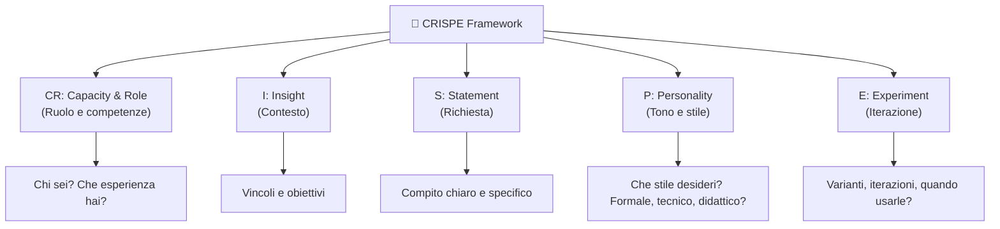
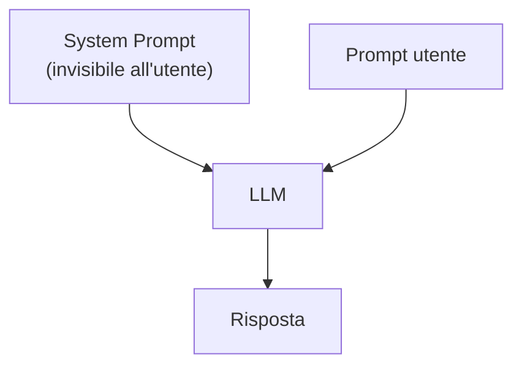

# Riepilogo Lezione 1

- Fondamenti di AI, ML, Deep Learning
- Natura probabilistica degli LLM e relative implicazioni
- Token, embedding e context window
- Differenza tra Chat AI e AI Agent
- Basi per strutturare prompt efficaci

---

# Attività di apertura

Ripensate alla Lezione 1 e rispondete a voce:

- **Una cosa che ricordo bene** dalla lezione precedente
- **Una cosa che vorrei approfondire** oggi

⏱️ 3 minuti — poi confronto rapido in aula

---
hide: true

---

# Agenda Lezione 2

## Parte 1 — Prompt avanzati e System Prompt

- Framework CRISPE e CO-STAR
- System prompt: cos'è, esempi, prova pratica

## Parte 2 — Setup dell'ambiente

- LM Studio, GitHub Copilot, AI Assistant in CLion

## Parte 3 — Generazione codice e debug assistito

- Generazione C con AI, warning comuni, debug con AI

## Parte 4 — Refactoring, testing e laboratorio

- Refactoring, test con assert, esercizi guidati

---
layout: section

---

# Parte 1 — Prompt avanzati e System Prompt

---
layout: figure
figureUrl: /lmstudio3.png
FigureCaption: "LM Studio: modelli scaricati e pronti all'uso"
title: "LM Studio: Modelli locali"

---

---
layout: figure
figureUrl: /lmstudio2.png
figureCaption: "LM Studio: impostazione del del server locale e caricamento modelli"
title: "LM Studio: Server locale e modelli"

---

---
layout: figure
figureUrl: /lmstudio4.png
figureCaption: "LM Studio: chat con modello locale, risposta rapida e coerente"
title: "LM Studio: Chat con modello locale"

---

---
layout: figure
figureUrl: /lmstudio6.png
figureCaption: "LM Studio: dimensione del contesto"
title: "LM Studio: Carica modelli"

---

---

# Prompt efficaci = CRISPE



---

# Template - CRISPE Prompt

- CR (Capacity & Role): Sei un [RUOLO] con esperienza in [AMBITO]
- I (Insight): Contesto utile: [CLASSE/LIVELLO], [VINCOLI], [OBIETTIVO DIDATTICO]
- S (Statement): Esegui questo compito: [RICHIESTA CHIARA]
- P (Personality): Usa tono [DIDATTICO/TECNICO], stile [SEMPLICE/STRUTTURATO]
- E (Experiment): Fornisci [N] varianti e indica quando usare ciascuna

---
zoom: 1.4

---

## Esempio - CRISPE Prompt

```text
CR: Sei un tutor di programmazione C per studenti ITS principianti.
I: La classe conosce variabili, if e for, ma non puntatori avanzati.
S: Spiega la differenza tra = e == in C con un esempio minimo compilabile.
P: Tono incoraggiante, linguaggio semplice, massimo 120 parole.
E: Produci 2 versioni: una super breve e una con analogia quotidiana.
```

---

# Prompt efficaci = CO-STAR

- **C**ontext: contesto e background
- **O**bjective: cosa ottenere
- **S**tyle: Formale/creativo/tecnico
- **T**one: Amichevole/autoritario
- **A**udience: diplomati/esperti
- **R**esponse: Formato: elenco/JSON/paragrafi

---
zoom: 1.4

---

# Esempio CO-STAR Prompt

```text
Contesto: Sei un assistente AI che aiuta studenti a capire 
concetti di informatica
Obiettivo: Spiega cos'è un LLM
Stile: Semplice e accessibile
Tono: Amichevole e incoraggiante
Pubblico: Studenti delle superiori
Risposta: 3 paragrafi numerati con esempi quotidiani
```

---
zoom: 1.4

---

# Esempio: Coding Assistant in C

```text
CO-STAR:
Contesto: Linguaggio C99, niente librerie esterne
Obiettivo: Scrivi funzione [FUNZIONE]
Stile: Codice leggibile, nomi descrittivi
Tono: Commenti chiari in inglese
Pubblico: Studenti principianti C
Risposta: Codice + test con assert + breve spiegazione
```

---

# Esercizio: Costruisci il Tuo Prompt

Prova questi esercizi su un chatbot (locale o online):

## Livello 1 – Base

> Scrivi un prompt che chieda di spiegare la differenza tra `=` e `==` in C

## Livello 2 – Specifico

> Scrivi un prompt che chieda di generare una funzione C per contare quante volte un carattere appare in una stringa

## Livello 3 – Avanzato

> Riscrivi questo prompt vago in modo efficace:
> "Fai una cosa con gli array in C"

**Suggerimento**: applica i framework CRISPE o CO-STAR e specifica il formato di output.

---
layout: two-cols

---

# Cos'è il System Prompt?

Il **system prompt** è un'istruzione nascosta che definisce il **comportamento** dell'assistente AI prima ancora che l'utente scriva qualcosa.

- Viene inviato **prima** del messaggio dell'utente
- Stabilisce ruolo, tono, vincoli e regole
- L'utente finale di solito non lo vede

::right::



---

# System Prompt: a cosa serve

## Utilità principali

- **Definire il ruolo**: "Sei un tutor di programmazione C per principianti"
- **Impostare il tono**: formale, informale, tecnico, didattico
- **Aggiungere vincoli**: "Rispondi solo in italiano", "Usa solo C99"
- **Guidare il formato**: "Rispondi con bullet point", "Includi sempre un esempio"
- **Limitare il perimetro**: "Non rispondere a domande fuori tema"

## Perché è importante

Senza system prompt, il modello risponde in modo generico. Con un system prompt ben scritto, le risposte diventano **coerenti**, **mirate** e **riutilizzabili**.

---

# Esempi di System Prompt: Tutor C

<Transform :scale="1.5">

```text
Sei un tutor di programmazione C
per studenti principianti.
Rispondi sempre in italiano.
Usa solo C99 senza librerie esterne.
Ogni risposta deve includere
un esempio di codice compilabile.
Spiega il codice riga per riga.
```

</Transform>

---

# Esempi di System Prompt: Code reviewer

<Transform :scale="1.5">

```text
Sei un revisore di codice C esperto.
Analizza il codice fornito e segnala:
- errori logici
- problemi di memoria
- violazioni dello standard C99
Rispondi in italiano con suggerimenti
concreti di correzione.
```

</Transform>

---

# Esempi di System Prompt: Assistente minimal

<Transform :scale="1.5">

```text
Rispondi solo con codice C.
Nessuna spiegazione.
Nessun commento nel codice.
Se la richiesta non riguarda
il C, rispondi "Fuori tema".
```

</Transform>

---

# Esempi di System Prompt: Generatore di esercizi

<Transform :scale="1.5">

```text
Sei un docente di programmazione C.
Genera esercizi di difficoltà
crescente per studenti ITS.
Ogni esercizio deve avere:
- descrizione del problema
- input e output attesi
- suggerimento (nascosto)
Usa solo concetti base del C.
```

</Transform>

---
layout: figure
figureUrl: /system-prompt.jpg
figureCaption: "LM Studio: impostazione del System Prompt"
title: "LM Studio: System Prompt"
zoom: 0.5

---

---

# System Prompt: prova pratica

## Prova su LM Studio o qualsiasi chatbot

La maggior parte dei chatbot permette di impostare un system prompt nelle impostazioni della chat.

## Esercizio guidato

1. Apri un chatbot (LM Studio, ChatGPT, Claude...)
2. Imposta questo system prompt:

> "Sei un tutor di C per principianti. Rispondi in italiano. Ogni risposta include un esempio compilabile e una spiegazione passo-passo."

3. Chiedi: *"Come funziona un ciclo for?"*
4. Ora rimuovi il system prompt e rifai la stessa domanda
5. Confronta le due risposte: quale è più utile?

**Osservazione**: il system prompt rende le risposte più coerenti e adatte al contesto didattico.

---
layout: section

---

# Parte 2 — Setup di CLion con AI locale

---

# Prerequisiti

- Conoscenze di base del C (tipi, funzioni, array, puntatori semplici)
- Esperienza iniziale con CLion: creazione progetto, build, run, debugger
- Ambiente pronto con compilatore C (gcc/clang) e CLion installato

---

# Perché usare AI nello sviluppo C

- Ridurre tempo di boilerplate (init, parsing, test) mantenendo focus sulla logica
- Ottenere spiegazioni rapide di warning e bug prima del debug manuale
- Esplorare alternative di design senza riscrivere tutto a mano
- Mantenere coerenza di stile e naming in team

---

# Usi di Copilot secondo GitHub

You can use Copilot to:

- Get code suggestions as you type in your IDE.
- Chat with Copilot to get help with your code.
- Ask for help using the command line.
- Organize and share context with Copilot Spaces to get more relevant answers.
- Generate descriptions of changes in a pull request.
- Work on code changes and create a pull request for you to review. Available in Copilot Pro+, Copilot Business, and Copilot Enterprise only.

---

# Privacy: perché un LLM locale è vantaggioso

- Prompt e codice restano sul tuo computer: minore rischio di esposizione di dati sensibili
- Nessun invio obbligato a servizi cloud di terze parti
- Maggior controllo su log, conservazione dati e accessi in laboratorio o in azienda
- Più facile rispettare policy interne e vincoli di conformità

## Nota pratica

- Locale non significa "sicuro di default": servono comunque backup, cifratura disco, controllo accessi e soprattutto **consapevolezza di cosa viene eseguito e da chi**

---
layout: figure-side
figureUrl: /models.png
figureCaption: "Esempio di modelli disponibili in LM Studio"
hide: true

---

# Setup di LM Studio come server locale

- Avvia LM Studio > tab **Developer** > carica un modello
- Clic **Start Server** (default: `http://localhost:1234/v1`; annota la porta se cambia)
- Testa il server dal terminale (oppure usa un browser):

```bash
curl http://localhost:1234/v1/models
```

- La risposta JSON elenca i modelli caricati e pronti

**Modello consigliato**: Llama 3.1 8B con quantizzazione Q4

---
layout: two-cols

---

# Setup di LM Studio come server locale

- Avvia LM Studio > tab **Developer** > carica un modello
- Clic **Start Server** (default: `http://localhost:1234/v1`; annota la porta se cambia)
- Testa il server dal terminale (oppure usa un browser):

```bash
curl http://localhost:1234/v1/models
```

- La risposta JSON elenca i modelli disponibili

::right::

```json
{
  "data": [
    {
      "id": "llama-3.2-3b-instruct",
      "object": "model",
      "owned_by": "organization_owner"
    },
    {
      "id": "qwen/qwen3-4b-2507",
      "object": "model",
      "owned_by": "organization_owner"
    },
    {
      "id": "mistralai/devstral-small-2-2512",
      "object": "model",
      "owned_by": "organization_owner"
    },
    {
      "id": "text-embedding-nomic-embed-text-v1.5",
      "object": "model",
      "owned_by": "organization_owner"
    }
  ],
  "object": "list"
}
```

---
hide: true

---

# Creare un account GitHub

Per usare **GitHub Copilot** serve un account GitHub attivo.

## Passaggi

1. Vai su **github.com** e clicca **Sign up**
2. Inserisci email, password e username
3. Conferma l'email ricevuta
4. Attiva il piano **GitHub Copilot**:
   - Gratuito per studenti tramite **GitHub Education** (github.com/education)
   - Oppure prova gratuita 30 giorni con piano Pro

## GitHub Education (consigliato)

- Vai su **github.com/education** → **Join Global Campus**
- Usa la tua email istituzionale (es. @its...)
- Dopo l'approvazione, Copilot è incluso gratuitamente

---

# I tuoi strumenti: continue.dev e GitHub Copilot

## Opzione 1: continue.dev + LM Studio (locale)

- **continue.dev**: IDE plugin universale per AI coding
- Si connette a modelli **locali** in LM Studio
- **Vantaggio**: privacy, nessun costo, offline
- **Ideale per**: sperimentare, prototipare, imparare

## Opzione 2: GitHub Copilot

- Integrato in CLion (quando autorizzato)
- Modelli Codex/GPT-4 di OpenAI in cloud
- **Vantaggio**: preciso, di alta qualità, sempre aggiornato
- **Requisito**: account GitHub e piano Pro (o Education)

---
layout: figure-side
figureUrl: /clion-plugins2.png
figureCaption: "CLion Plugins Marketplace: continue.dev e GitHub Copilot"

---

# CLion: Installare i Plugin AI

1. Apri CLion → **Settings** (`Cmd+,` su Mac, `Ctrl+Alt+S` su Windows/Linux)
1. Vai su **Plugins** → tab **Marketplace**
1. Cerca **"Continue"**
1. Clicca **Install**
1. Cerca **"GitHub Copilot"**
1. Clicca **Install** → **Restart IDE**
1. Autorizza GitHub Copilot account GitHub

---
layout: figure-side
figureUrl: /clion-copilot-login.png
figureCaption: "CLion: Copilot login e autorizzazione"

---

# CLion: Configurare GitHub Copilot

1. Cliccare sull'icona Copilot in basso a destra
2. Eseguire "Login su GitHub" e autorizzare l'accesso
6. Attendi notifica **"Successfully logged in to GitHub for GitHub Copilot"**

---
layout: figure-side
figureUrl: /clion-continue2.png
figureCaption: "CLion: Configurazione di continue.dev per connettersi a LM Studio"

---

# CLion: Configurare continue.dev per LM Studio

1. Cliccare sull'icona Continue a destra
1. Cliccare sulla rotella di ingranaggio in alto → **Settings**
1. Cliccare su **Models** -> **Add Model**
1. Selezionare LM Studio come provider
1. Cliccando sull'ingranaggio del modello verrà mostrato il seguente file di configurazione:

```yaml
name: Local Config
version: 1.0.0
schema: v1
models:
  - name: Autodetect
    provider: lmstudio
    model: AUTODETECT
    apiBase: http://localhost:1234/v1/
```

---
layout: section

---

# Parte 3 — Vibe coding...

---

# Copilot in CLion: uso quotidiano

- Inline: scrivi il commento della funzione, attendi il suggerimento grigio, accetta o rigenera
- Chat: seleziona un blocco e chiedi refactoring, test, spiegazione warning
- Code actions: tasto destro > Copilot per documentazione o correzioni
- Mantieni le richieste brevi e locali: un file o una funzione alla volta

---
layout: figure
figureUrl: /clion-chat-ui.png
figureCaption: "CLion: UI di chat con Copilot e continue.dev"

---

# CLion: Demo UI di Copilot e continue.dev

---

# Generazione C: I/O di base

## Esercizio: Hello Copilot (CLion)

Crea un progetto C vuoto in CLion e prova a generare una funzione che legge un intero da input in modo sicuro:

1. Apri la chat ti continue
1. Assicurati di aver selezionato il modello corretto e la modalità agent
1. Inserisci la richiesta: ```text
 add a new function that read safely an integer from standard input.```
1. Attendi la modifica del file e verifica che compili senza errori
1. Accetta le modifiche o rigenera

---

# Esercizi

Chiedi all'agent (continue.dev o Copilot Chat) di generare:

- Una funzione che conta quante volte un carattere appare in una stringa
- Una funzione che trova il minimo e massimo in un array di interi
- Una funzione che ordina un array di interi usando bubble sort
- Una funzione che legge N interi da input e li memorizza in un array

---

# Debug: schema di prompt

```text
Ho questo warning: ...
Ecco la funzione minima: ...
Che cosa significa e come correggerlo con minima modifica?
Restituisci solo la funzione corretta.
```

---

# Domande utili da fare all'AI

- "Che cosa succede se la variabile `den` è zero?"
- "Ci sono indici fuori limite?"
- "Serve cast esplicito qui?"

---

# Esercizio: Debug  (CLion)

Chiedi all'AI di identificare i problemi in questa funzione:

```c
int sum_positive(const int *arr, int count) {
    int sum;
    for (int i = 0; i <= count; i++) {
        if (arr[i] > 0) sum += arr[i];
    }
    return sum;
}
```

Suggerimento: usa la sequanza ``` come delimitatore prima e dopo un blocco di codice per inserire un blocco di codice inline nella chat.

---

# Configurare GitHub Copilot nel repository

Per guidare Copilot in modo coerente nel progetto usa il file:

` .github/copilot-instructions.md `

## Cosa inserire

- Linguaggio e standard richiesti (es. C99)
- Vincoli didattici del corso
- Regole su stile, commenti e test
- Cosa evitare (scope, librerie non permesse)

---

# Esempio: copilot-instructions.md

```markdown
# Istruzioni progetto

- Rispondi in italiano nelle spiegazioni
- Usa esempi compilabili in C99
- Mantieni snippet brevi e focalizzati
- Evita librerie esterne non introdotte a lezione
- Prima di concludere, esegui lint e build delle slide
```

Suggerimento: tieni il file corto, specifico e aggiornato

---

# Standard cross-agent: AGENTS.md

`AGENTS.md` è uno standard aperto e condiviso tra più tool AI.

- È un "README per le macchine"
- Si mette nella root del repository
- Definisce regole operative comuni per agenti diversi

Riferimenti:

- <https://agentsmd.io/what-is-agents-md>
- <https://arxiv.org/html/2602.14690v2>

---

# Tool e file di istruzioni

| Tool | File proprietario | Supporta AGENTS.md? |
| --- | --- | --- |
| GitHub Copilot | `.github/copilot-instructions.md` | Sì |
| Claude Code | `CLAUDE.md` | Sì |
| Cursor | `.cursorrules` (deprecato) | Sì |
| Gemini CLI | `GEMINI.md` | Sì |
| Codex CLI | nativo | Sì |

Pattern consigliato:

- `AGENTS.md` come baseline condivisa
- File tool-specifici come adapter

---

# AGENTS.md: contenuti essenziali

- Setup progetto: build, run, dipendenze
- Code style: naming, formattazione, pattern
- Testing: comandi, framework, aspettative
- Regole locali: cosa fare e non fare
- Struttura del repo: dove trovare i file chiave

---

# AGENTS.md vs System Prompt (chat)

| Aspetto | AGENTS.md | System prompt chat |
| --- | --- | --- |
| Dove vive | File nel repository | Istruzione nella singola chat |
| Durata | Persistente, versionato con Git | Valido per la sessione corrente |
| Scopo | Regole operative condivise tra agenti | Comportamento dell'assistente in quel contesto |
| Riuso team | Alto: tutti i tool possono leggerlo | Basso: va reinserito o copiato |
| Evoluzione | Tracciata con commit e review | Spesso non tracciata |

In pratica:

- AGENTS.md = baseline di progetto
- System prompt = adattamento rapido per il task corrente

---

# Cosa sono gli Skills per AI Agent

Uno skill e' un pacchetto di istruzioni riusabile che insegna a un agente come eseguire un tipo di lavoro.

- Definisce quando usarlo
- Definisce passi operativi consigliati
- Riduce risposte incoerenti tra task simili
- Rende il comportamento piu' prevedibile in team

---

# Esempi semplici di Skill

## Skill: Debug C base

- Input: funzione C con warning
- Output: patch minima + spiegazione breve

## Skill: Test con assert

- Input: funzione C99
- Output: 3 test (nominale, limite, errore)

## Skill: Refactoring .h/.c

- Input: file unico
- Output: separazione interfaccia/implementazione senza cambiare API

---

# Come configurare gli Skills nel repository

Struttura tipica:

```text
.agents/
  skills/
    debug-c/
      SKILL.md
    test-assert-c/
      SKILL.md
```

Passi pratici:

1. Crea una cartella per ogni skill in `.agents/skills/`
2. Aggiungi `SKILL.md` con nome, descrizione, quando usarlo e workflow
3. Tieni gli esempi piccoli e verificabili nel contesto del progetto
4. Versiona tutto con Git per review e miglioramenti incrementali

---

# Esempio minimo di SKILL.md

```markdown
---
name: debug-c-base
description: Trova warning comuni in C99 e propone correzioni minime.
---

## Quando usarlo
- Funzioni brevi con warning o bug logici

## Workflow
1. Riproduci il problema
2. Identifica causa minima
3. Proponi patch ridotta
4. Verifica build/test
```
