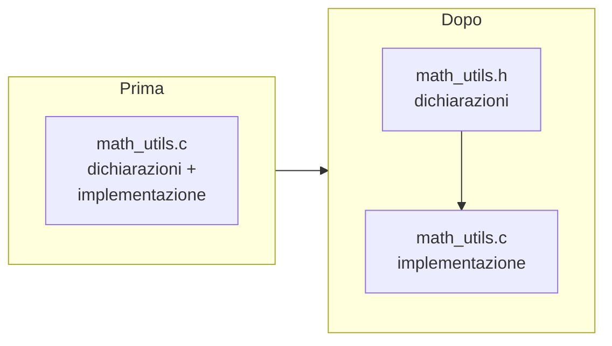

# Parte 4 — Refactoring, testing e laboratorio

---

# Refactoring: obiettivi

- Leggibilità senza cambiare comportamento
- Ridurre duplicazione
- Separare interfaccia (.h) da implementazione (.c)



---

# Separare header e sorgente

```c
// math_utils.h
#ifndef MATH_UTILS_H
#define MATH_UTILS_H

int clamp_int(int value, int min, int max);

#endif
```

```c
// math_utils.c
#include "math_utils.h"

int clamp_int(int value, int min, int max) {
    if (min > max) {
        return value;
    }
    if (value < min) return min;
    if (value > max) return max;
    return value;
}
```

- Chiedi all'assistente di creare test separati

---

# Refactoring con AI

- Chiedi di rinominare funzioni/variabili mantenendo l'API
- Richiedi separazione in file `.c` e `.h` indicando le firme
- Domanda tipica: "Proponi un refactoring che migliori la leggibilità senza cambiare il comportamento"
- Verifica con diff ridotti e compilazione

---

# Commenti essenziali

- Spiega il perché, non il cosa
- Mantieni commenti brevi in inglese
- Rimuovi commenti obsoleti dopo il refactoring

---

# Esercizio: Refactoring Sprint (CLion)

Sfida a tempo!

1. Prendi la funzione `find_value`
2. Chiedi a Copilot di estrarre controlli in funzione dedicata
3. Separa in `.h` e `.c`
4. Verifica che compili senza warning

⏱️ 10 minuti — chi finisce per primo?

---

# Test: checklist

- Casi nominali e casi limite
- Input null, array vuoti, indici oltre range
- Confronto output atteso vs ottenuto

---

# Test manuali con assert

```c
#include <assert.h>

void test_find_value(void) {
    int data[] = {1, 2, 3};
    assert(find_value(data, 3, 2) == 1);
    assert(find_value(data, 3, 5) == -1);
}

int main(void) {
    test_find_value();
    return 0;
}
```

---

# Test tabellari: esempio visivo

| Input | Funzione | Expected | Actual | Pass? |
| --- | --- | --- | --- | --- |
| `{1,2,3}`, target=2 | `find_value` | `1` | `1` | ✅ |
| `NULL`, target=1 | `find_value` | `-1` | `-1` | ✅ |
| `{}`, count=0, target=1 | `find_value` | `-1` | ? | ❓ |
| `{5,5,5}`, min/max | `range_min_max` | `5/5` | ? | ❓ |

Chiedi all'assistente di generare il codice di test per ogni riga.

---

# Gestione degli errori nei test

- Testare percorsi negativi (null pointer, count zero)
- Verificare codici di ritorno coerenti
- Documentare cosa succede su input non valido

---

# Valutare la copertura

- Non serve misurare numericamente, ma copri rami principali
- Usa input piccoli e riproducibili
- Aggiorna i test dopo refactoring

---

# Esercizio: Test Factory (CLion)

Sfida: genera il maggior numero di **test validi** per `range_min_max` in 5 minuti!

- Includi array con tutti valori uguali
- Prova array con un solo elemento
- Testa con `NULL` e count=0
- Confronta con una versione proposta dall'assistente

⏱️ 5 minuti — chi produce più test che passano?

---

# Lavorare in team con AI

## Attività: Prompt Gallery

Condividete a voce il vostro **miglior prompt** usato finora. Votate alzando la mano i più efficaci!

⏱️ 5 minuti

---

# Pair programming con AI

- Scrivi tu la struttura, fai completare dettagli
- Chiedi spiegazioni brevi delle scelte
- Interrompi e riparti se l'output diventa rumoroso
- L'assistente dimentica se il prompt è lungo: riassumi!

---

# Esercizio di gruppo (CLion)

Progetto collaborativo:

1. Dividi un problema in funzioni (es. "programma che legge N interi, trova min/max, e stampa statistiche")
2. Assegna a ciascuno un prompt per generare la propria parte
3. Integra e testa insieme in CLion
4. Verifica con la checklist:
   - ☐ Codice compila?
   - ☐ Input invalidi gestiti?
   - ☐ Commenti essenziali e aggiornati?

⏱️ 20 minuti

---

# Sfida aperta di laboratorio (CLion)

## Il tuo mini-progetto

Costruisci un programma C con:

- ☐ Almeno **2 funzioni** in file separati (.h/.c)
- ☐ Almeno **3 test** con assert
- ☐ Gestione di **input non validi**
- ☐ Un breve **README** con: funzioni, test eseguiti, problemi aperti

Usa l'AI come vuoi, ma **documenta ogni interazione** nelle note!

⏱️ 50 minuti

---

# Suggerimenti per il laboratorio

Idee di progetto (scegli una):

1. **Calcolatore statistiche**: leggi N interi, calcola media, min, max
2. **Gestore rubrica**: array di struct con nome e valore, cerca per nome
3. **Validatore input**: leggi stringhe numeriche e verifica formato

## Passi consigliati

1. Crea progetto e `main.c` — verifica build
2. Implementa funzioni con Copilot
3. Estrai header e separa file
4. Scrivi test con assert
5. Redigi README con l'aiuto dell'assistente

---

# FAQ - L'assistente sbaglia

- Prova un prompt più breve
- Chiedi di spiegare passo-passo
- Cambia vincoli (es. rimuovi malloc) e rigenera

---

# FAQ - Output troppo lungo

- Chiedi "solo codice"
- Specifica numero di righe o blocchi
- Separa la richiesta in due prompt

---

# FAQ - Codice non compila

- Incolla l'errore preciso nel prompt
- Chiedi una patch minima, non una riscrittura
- Verifica include e tipi mancanti

---

# Riepilogo Lezione 2

- Framework CRISPE e CO-STAR per prompt strutturati
- System prompt: ruolo, vincoli, formato
- Setup completo: LM Studio + Copilot + AI Assistant in CLion
- Generazione codice C: I/O, ricerca, min/max, struct
- Debug assistito: warning, errori, tracciamento input
- Refactoring: separazione .h/.c, rinomina, commenti
- Testing: assert, test tabellari, copertura

---

# Biglietto d'uscita — Lezione 2

Rispondete a voce o su un foglio:

- Il mio prompt più efficace di oggi
- Cosa mi ha sorpreso dell'AI
- Una cosa che voglio approfondire nella prossima lezione
