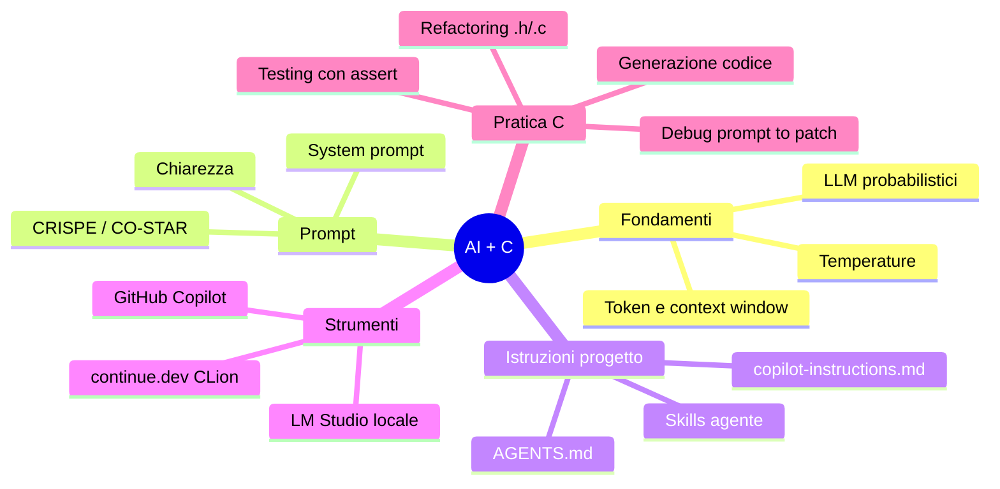

# Agenda Lezione 3

## Parte 1 — Ripasso e consolidamento (~30 min)

- Riepilogo del corso (Lezione 1 + Lezione 2)
- Teach-back in coppia
- FAQ e suggerimenti finali

## Parte 2 — Preparazione e test finale (~30 min + 60 min)

- Regole e rubrica di valutazione
- Test finale (60 minuti)

---

# Riepilogo del corso

## Lezione 1 — Fondamenti

- AI, ML, Deep Learning: relazione e differenze
- LLM: modelli probabilistici, token, embedding, context window
- Temperature: controllo casualità nell'output
- Chat AI vs AI Agent
- Prompt efficaci: chiarezza, specificità, contesto

## Lezione 2 — Strumenti e pratica

- Framework CRISPE e CO-STAR per prompt strutturati
- System prompt: ruolo, vincoli, formato
- Istruzioni di progetto: `copilot-instructions.md` e `AGENTS.md`
- Skills per agenti AI: definizione e configurazione nel repo
- Setup: LM Studio + GitHub Copilot + continue.dev in CLion
- Generazione codice C con AI, debug assistito

---

# Mappa concettuale del corso

---

# Concetti chiave da ricordare

- L'AI **non comprende**: predice il token successivo
- Prompt migliore = risposta migliore
- **Sempre verificare**: compilare, testare, leggere il codice
- Privacy: LLM locale vs cloud
- `AGENTS.md` e skills rendono il comportamento riproducibile
- Il system prompt guida l'AI nella sessione corrente

---

# Teach-back

Consolidamento in coppia:

1. **Insegna al compagno** un concetto chiave del corso (2 min ciascuno)
2. Discutete i **3 comandi/pattern più utili** che avete scoperto
3. Raccogliete i prompt e snippet riutilizzabili

---

# FAQ - L'assistente sbaglia

- Prova un prompt più breve e specifico
- Chiedi di spiegare passo-passo
- Cambia vincoli (es. rimuovi malloc) e rigenera
- Non fidarti: verifica sempre compilando e testando

---

# FAQ - Output troppo lungo

- Chiedi "solo codice"
- Specifica numero di righe o blocchi
- Separa la richiesta in due prompt più piccoli

---

# FAQ - Codice non compila

- Incolla l'errore preciso nel prompt
- Chiedi una patch minima, non una riscrittura
- Verifica include e tipi mancanti

---

# Risorse consigliate

- I prompt e snippet salvati durante il corso
- JetBrains AI Assistant: [jetbrains.com/help/ai-assistant](https://www.jetbrains.com/help/ai-assistant/)
- GitHub Copilot Docs: [docs.github.com/copilot](https://docs.github.com/en/copilot)

---

# Suggerimenti finali

- Pochi prompt, mirati e brevi
- Compila spesso, testa casi limite
- Mantieni traccia di cosa hai accettato dall'assistente
- Il system prompt rende le risposte più coerenti
