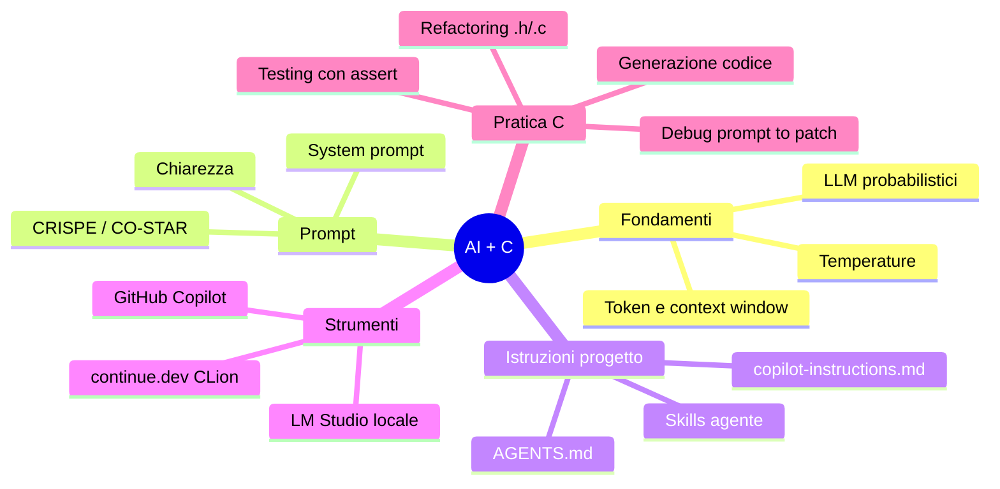

# Riepilogo del corso

## Lezione 1 — Fondamenti

- AI, ML, Deep Learning: relazione e differenze
- LLM: modelli probabilistici, token, embedding, context window
- Temperature: controllo casualità nell'output
- Chat AI vs AI Agent
- Prompt efficaci: chiarezza, specificità, contesto

## Lezione 2 — Strumenti e pratica

- Framework CRISPE e CO-STAR per prompt strutturati
- System prompt: ruolo, vincoli, formato
- Istruzioni di progetto: `copilot-instructions.md` e `AGENTS.md`
- Skills per agenti AI: definizione e configurazione nel repo
- Setup: LM Studio + GitHub Copilot + continue.dev in CLion
- Generazione codice C con AI, debug assistito

---

# Mappa concettuale del corso



---

# Concetti chiave da ricordare

- L'AI **non comprende**: predice il token successivo
- Prompt migliore = risposta migliore
- **Sempre verificare**: compilare, testare, leggere il codice
- Privacy: LLM locale vs cloud
- `AGENTS.md` e skills rendono il comportamento riproducibile
- Il system prompt guida l'AI nella sessione corrente

---

# Risorse consigliate

- I prompt e snippet salvati durante il corso
- GitHub Copilot Docs: [docs.github.com/copilot](https://docs.github.com/en/copilot)
- LM Studio: [lmstudio.ai](https://lmstudio.ai/)
- Anthropic Documentation: [docs.anthropic.com](https://docs.anthropic.com/)

---

# Esercitazione CLion

Rifare con l'aiuto di Copilot l'esercizio visto nel corso di C:

> ## Esercizio: indovina il numero
>
> - Scrivere un programma “Indovina il numero” che:
> - chiede all’utente il valore massimo e il numero massimo di tentativi
> - genera un numero casuale in [0, max]
> - richiede i tentativi all’utente indicando se il numero inserito è troppo alto o troppo basso
> - termina con messaggio di successo o di esaurimento tentativi mostrando la soluzione
>
>```c
>   srand(time(NULL)); // Seed the random number generator
>    number = rand() % (max_number + 1); // Generate a random number between 0 and max_number
>
>```

---

# Suggerimenti finali

- Pochi prompt, mirati e brevi
- Compila spesso, testa casi limite
- Mantieni traccia di cosa hai accettato dall'assistente
- Il system prompt rende le risposte più coerenti
