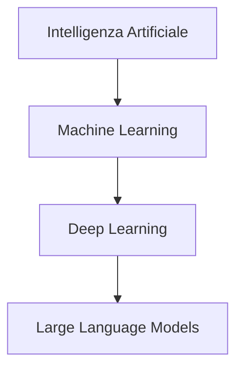

# Programmazione assistita dall'Intelligenza Artificiale

Ing. Giancarlo Degani

---

# Argomenti del corso

- Introduzione alla Programmazione Assistita da AI
- Il Ruolo dell'Al come Assistente Intelligente
- L'Arte del Prompt Efficace
- Iterazione e Ottimizzazione dei Prompt

---

# Terminologia

- **Modello**: rete neurale addestrata a prevedere la parola/token successivo
- **Contesto**: finestra limitata di testo che guida la risposta
- **Prompt**: istruzioni testuali usate per ottenere un comportamento desiderato
- **Agent**: sistema che combina il modello con strumenti esterni e loop di ragionamento

---

# Machine Learning e Deep Learning

## Machine Learning (ML)

Sottocampo dell'AI dove i sistemi **imparano dai dati** senza essere programmati esplicitamente.

## Deep Learning (DL)

Sottocampo del ML che usa **reti neurali artificiali profonde** (molti livelli) per apprendere rappresentazioni complesse.

## Relazione gerarchica



---

# Cos'è un LLM

**Large Language Model** (LLM): modello linguistico di grandi dimensioni basato su reti neurali.

## Caratteristiche principali

- Miliardi di parametri (pesi neurali)
- Addestrato su enormi quantità di testo da Internet
- Capace di comprendere e generare linguaggio naturale
- Capace di generare codice in molti linguaggi di programmazione

## Esempi

GPT-4, Claude, Gemini, Llama, DeepSeek

---

# Architettura Transformer

Gli LLM moderni si basano sull'architettura **Transformer** (2017), che usa meccanismi di **attenzione** per elaborare il linguaggio.

## Meccanismo di attenzione

Permette al modello di "concentrarsi" su parti rilevanti del contesto quando genera ogni token.

## Vantaggi rispetto a architetture precedenti

- Elaborazione parallela (più veloce)
- Cattura relazioni a lungo raggio nel testo
- Scala efficacemente con dati e potenza di calcolo

---

# Come funzionano gli LLM: processo di generazione

## Processo passo-passo

1. **Tokenizzazione**: il testo viene diviso in token (pezzi di parole)
   - Esempio: `"printf"` → `["print", "f"]`
2. **Embedding**: ogni token diventa un vettore numerico
   - Rappresentazione matematica del significato
3. **Elaborazione**: passaggio attraverso molti layer di trasformazione
   - Centinaia di miliardi di operazioni matematiche
4. **Predizione**: il modello predice il token successivo più probabile
   - Calcola probabilità per tutti i possibili token

Il processo si ripete token per token fino a generare la risposta completa.

---

# LLM come strumenti probabilistici

## Concetto fondamentale ⚠️

Gli LLM **non comprendono** il linguaggio come gli umani.

Sono modelli statistici che predicono la sequenza di parole più probabile.

## Come funziona la predizione

- Dato un contesto (prompt), il modello calcola la probabilità di ogni possibile token successivo
- Sceglie il token con probabilità più alta (o campiona dalla distribuzione)
- Ripete il processo per generare testo completo

## Esempio

Input: `"Il sole sorge a..."`

- `"est"` → 85%
- `"oriente"` → 10%
- `"ovest"` → 2%

---

# Implicazioni della natura probabilistica

## Vantaggi

- Output fluido e naturale
- Creatività e variabilità nelle risposte
- Capacità di gestire input imperfetti

## Limiti

- **Allucinazioni**: generazione di informazioni false ma plausibili
- **Inconsistenza**: output diversi per stesso input
- **Mancanza di ragionamento logico** vero
- **Nessuna garanzia** di correttezza

## Regola d'oro ⚠️

**Valida sempre l'output** - compila, testa, verifica la logica del codice generato

---

# Temperature e casualità

Gli LLM permettono di controllare la casualità dell'output tramite il parametro **temperature**.

## Temperature bassa (0.0 - 0.3)

- Output deterministico e prevedibile
- Sceglie sempre il token più probabile
- **Uso**: codice, traduzioni, task tecnici

## Temperature media (0.5 - 0.7)

- Bilanciamento tra prevedibilità e creatività
- **Uso**: scrittura generale, assistenza

## Temperature alta (0.8 - 1.0+)

- Output creativo e vario
- Maggiore casualità nella selezione
- **Uso**: brainstorming, scrittura creativa

---

# Context window: concetti base

## Cos'è il Context Window

Quantità massima di testo che un LLM può "vedere" contemporaneamente (input + output).

È come la **memoria a breve termine** del modello.

## Misurazione in token

Il context window si misura in **token**, non in parole:

- 1 token ≈ 0.75 parole in inglese
- 1 token ≈ 0.5-0.7 parole in italiano

Esempio: `"printf(\"Hello\");"` = circa 5-6 token

---

# Context window: limiti pratici

## Esempi di limiti nei modelli attuali

- **GPT-3.5**: 4K-16K token (~3K-12K parole)
- **GPT-4**: 8K-128K token (~6K-96K parole)
- **Claude 3**: fino a 200K token (~150K parole)

## Implicazioni pratiche per lo sviluppo

- **Conversazioni lunghe** "dimenticano" l'inizio
- **Documenti troppo lunghi** vanno divisi in parti
- **Necessità di riassumere** periodicamente il contesto
- **File di codice grandi** potrebbero non entrare completamente
- Strategia: fornire solo il codice rilevante al task corrente

---

# Cos'è una Chat AI

Una **Chat AI** (o chatbot AI) è un'interfaccia conversazionale che permette di interagire con un LLM tramite dialogo in linguaggio naturale.

## Componenti principali

- **LLM sottostante**: il modello che genera risposte
- **Interfaccia utente**: dove si scrive e si legge
- **Memoria conversazionale**: mantiene il contesto del dialogo
- **System prompt**: istruzioni che definiscono il comportamento

## Esempi

ChatGPT, Claude, Gemini, Perplexity, GitHub Copilot Chat

---

# Cos'è un AI Agent

Un **AI Agent** è un sistema AI più avanzato che può:

- Pianificare sequenze di azioni
- Usare strumenti esterni (API, database, esecuzione codice)
- Prendere decisioni autonome
- Eseguire task complessi multi-step

## Esempio pratico

Sistema che cerca informazioni su web, legge documenti, scrive un report e lo invia via email.

---

# Chat AI vs AI Agent: differenze

## Confronto delle caratteristiche

| Aspetto | Chat AI | AI Agent |
|---------|---------|----------|
| Interazione | Risponde a domande | Esegue azioni |
| Autonomia | Limitata | Elevata |
| Strumenti | Solo LLM | LLM + tool esterni |
| Complessità | Singolo scambio | Multi-step planning |

## Quando usare cosa

- **Chat AI**: per spiegazioni, suggerimenti, completamento codice
- **AI Agent**: per task complessi che richiedono più passi e uso di strumenti

---

# LM Studio: eseguire LLM in locale

LM Studio permette di scaricare ed eseguire modelli LLM sul proprio computer.


**Vantaggi**: privacy, nessun costo API, lavoro offline

---

# Perché usare agent AI nello sviluppo C

- Ridurre tempo di boilerplate (init, parsing, test) mantenendo focus sulla logica
- Ottenere spiegazioni rapide di warning e bug prima del debug manuale
- Esplorare alternative di design senza riscrivere tutto a mano
- Mantenere coerenza di stile e naming in team

---

# GitHub Copilot in breve

- Suggerimenti inline mentre si scrive in CLion (C, CMake, markdown)
- Copilot Chat per spiegazioni, refactoring, generazione test e fix mirati
- Non esegue il codice: serve sempre compilare/testare e fare review umana
- Può proporre codice non sicuro o incompleto: verificare input, error handling, limiti

---

# Configurare CLion con GitHub Copilot

- CLion > Settings/Preferences > Plugins > Marketplace: installa "GitHub Copilot" e "GitHub Copilot Chat"
- Riavvia CLion, poi login GitHub quando richiesto (Authorize nel browser)
- Settings > Tools > GitHub Copilot: abilita completamenti inline e scegli la keymap preferita
- Settings > Tools > GitHub Copilot Chat: abilita la chat e assegna uno shortcut
- Facoltativo: limita telemetria e riduci suggerimenti per file di grandi dimensioni

---

# Copilot in CLion: uso quotidiano

- Inline: scrivi il commento della funzione, attendi il suggerimento grigio, accetta o rigenera
- Chat: seleziona un blocco e chiedi refactoring, test, spiegazione warning
- Code actions: tasto destro > Copilot per documentazione o correzioni
- Mantieni le richieste brevi e locali: un file o una funzione alla volta

---

# Prompt efficaci per agent e Copilot

- Specifica standard e vincoli: "usa C99, niente librerie esterne, input validato"
- Fornisci interfacce: firme funzioni, strutture dati attese, range input
- Chiedi output in un formato: "solo codice", "spiega in 3 bullet", "mostra patch"
- Includi esempi minimi: input atteso, comportamento edge

---

# Strategie di verifica

- Compila sempre dopo ogni suggerimento accettato
- Aggiungi assert e controlli su input/null pointer prima di fidarti
- Confronta la patch proposta con un diff piccolo e leggibile
- Esegui test su casi limite (array vuoti, overflow, indici out-of-range)

---

# Esempi di richieste veloci

- "Scrivi una funzione C99 che normalizza un valore int in [0,1], senza float"
- "Spiega questo warning di clang e proponi fix minimale"
- "Genera test per questa funzione che calcola mediana, includi casi dispari/pari"
- "Separa questo file in .h/.c mantenendo le firme"

---

# Checklist rapida prima di chiedere

- Qual è il file o la funzione? incolla solo il necessario
- Vincoli dichiarati (C99, no librerie esterne, limiti di input)
- Formato di output richiesto (solo codice, patch, 3 bullet)
- Test o input di esempio da usare per validare

---

# Prerequisiti

- Conoscenze di base del C (tipi, funzioni, array, puntatori semplici)
- Esperienza iniziale con CLion: creazione progetto, build, run, debugger
- Ambiente pronto con compilatore C (gcc/clang) e CLion installato

---

# Strumenti di lavoro

- CLion con toolchain C configurata
- Terminale per compilare ed eseguire
- Assistente AI testuale (es. Copilot Chat) integrato nell'IDE o nel browser
- Risorse progetto: repository, task tracker, documentazione

---

# Uso responsabile e limiti

- Verificare sempre il codice generato: compilazione, test, lettura manuale
- Non condividere dati sensibili nei prompt
- Citare la fonte AI quando si riutilizzano frammenti significativi
- Preferire piccoli passi iterativi per mantenere il controllo
- Conservare decisioni e motivazioni nei messaggi di commit

---

# Flusso di lavoro assistito (pattern)

- Definisci il contesto: obiettivo, vincoli, file coinvolti
- Chiedi un output piccolo e verificabile
- Esegui e osserva errori o warning
- Condividi log e snippet minimi nell'IDE/chat
- Itera fino a un risultato compilabile e leggibile

---

# Strutturare i prompt

- Contesto: cosa fa il programma, vincoli (C99, senza librerie extra)
- Compito: cosa vuoi ottenere (funzione, test, refactoring)
- Vincoli: lunghezza, stile, interfacce esistenti
- Output: formato atteso (solo codice, spiegazione breve, passi)

---

# Prompt di esempio (generazione)

Testo da dare all'assistente:

```text
Ho un programma C su CLion. Scrivi una funzione C99 che calcola la media di un array di int.
Non usare librerie extra. Mantieni i parametri const ove possibile. Aggiungi un breve commento.
Restituisci solo il codice della funzione.
```

---

# Esempio di codice generato

```c
#include <stddef.h>

double mean_ints(const int *values, size_t count) {
    if (values == NULL || count == 0) {
        return 0.0; // defend against invalid input
    }

    long sum = 0;
    for (size_t i = 0; i < count; ++i) {
        sum += values[i];
    }

    return (double)sum / (double)count;
}
```

---

# Debug assistito

- Fornisci messaggi di errore completi (compilatore o runtime)
- Invia solo la funzione o il file minimo riproducibile
- Chiedi spiegazioni passo-passo: cosa significa l'errore, dove guardare

Esempio di prompt per un `segmentation fault`:

```text
Ho un segmentation fault in questa funzione C. Ecco la funzione e l'input che lo causa.
Spiega la causa probabile e proponi una correzione minimale.
```

---

# Snippet per il debug

```c
#include <stdio.h>

int read_value(const int *buffer, size_t length, size_t index) {
    if (buffer == NULL || index >= length) {
        return -1; // invalid access avoided
    }
    return buffer[index];
}

int main(void) {
    int data[] = {3, 5, 7};
    printf("%d\n", read_value(data, 3, 5));
    return 0;
}
```

- L'assistente può evidenziare l'accesso fuori limite (`index >= length`)
- Dopo la correzione, ricompila e riesegui il test

---

# Snippet: clamp e normalizza

```c
#include <stddef.h>

int clamp_int(int value, int min, int max) {
    if (min > max) {
        return value; // invalid bounds, return as-is
    }
    if (value < min) {
        return min;
    }
    if (value > max) {
        return max;
    }
    return value;
}

double normalize_int(int value, int min, int max) {
    if (min >= max) {
        return 0.0; // avoid divide-by-zero
    }

    int clamped = clamp_int(value, min, max);
    return (double)(clamped - min) / (double)(max - min);
}
```

- Usabile come esempio di output generato, con controlli minimi
- Valuta con l'assistente varianti senza double se richiesto

---

# Refactoring con AI

- Chiedi di rinominare funzioni/variabili mantenendo l'API
- Richiedi separazione in file `.c` e `.h` indicando le firme
- Domanda tipica: "Proponi un refactoring che migliori la leggibilità senza cambiare il comportamento"
- Verifica con diff ridotti e compilazione

---

# Documentazione e commenti

- Domanda tipica: "Aggiungi commenti essenziali e brevi a questo file"
- Mantieni commenti in inglese per il codice C del corso
- Evita commenti ridondanti; privilegia il perché rispetto al cosa

---

# Testing e validazione

- Genera casi di test piccoli e mirati (input validi e edge case)
- Automatizza dove possibile con script di build/test
- Confronta l'output atteso con quello osservato; condividi le differenze nell'IDE

---

# CLion + AI: flusso pratico

- Crea un nuovo progetto C eseguibile
- Scrivi la funzione con l'assistente in un file `.c`
- Usa il debugger per ispezionare variabili e stack
- Chiedi all'assistente di interpretare un backtrace o un warning
- Integra correzioni e ripeti il ciclo build-run-debug

---

# Collaborazione e tracciabilità senza Git

- Conserva versioni successive dei file con copie datate (backup locali o cloud)
- Annota decisioni e motivazioni in un file README o diario di bordo
- Condividi con il team patch piccole o differenze testuali (diff) generate dall'assistente
- Preferisci piccoli passi: modifica, salva copia, verifica, poi passa alla successiva

---

# Esercitazioni proposte (ore 8-9)

- Usa Copilot per generare una funzione che normalizza un int in [0,1] senza float; poi aggiungi a mano controlli su overflow e input negativi
- Chiedi a Copilot di separare un file unico in .h/.c mantenendo le firme; verifica con clang che non ci siano warning
- Fornisci a Copilot un warning reale di clang e chiedi spiegazione + patch; applica solo se il diff è minimo e leggibile
- Genera con Copilot test per edge case (array vuoti, indici fuori limite) per una funzione di lettura da array, poi esegui e valida l'output
- Bonus: chiedi a Copilot di scrivere un CMakeLists.txt minimale per buildare i file creati e integrare i test

---

# Test finale (ora 10)

- Durata: 60 minuti, individuale
- Consegna: repository o archivio con codice e breve README
- Valutazione: correttezza, chiarezza del codice, capacità di usare l'AI in modo controllato
- Suggerimento: preparare snippet e prompt riutilizzabili durante il corso

---

# Ora 1 - Cosa vedrai

- Ruolo dell'AI nello sviluppo C
- Obiettivi pratici del corso e modalità d'uso in CLion
- Aspettative: suggerimenti, non magia

---

# Ora 1 - Setup minimo

- CLion installato con toolchain C (gcc/clang)
- Progetto C vuoto per provare i prompt
- Copilot Chat attivo per domande e correzioni rapide

---

# Ora 1 - Perché usare AI ora

- Ridurre tempo su boilerplate e ricerca API
- Ottenere spiegazioni immediate di warning
- Generare alternative e confrontarle rapidamente

---

# Ora 1 - Rischi comuni

- Accettare codice senza verifiche
- Prompt vaghi che producono output inutili
- Dipendenza dall'assistente per concetti base

---

# Ora 1 - Metriche di successo

- Compila al primo tentativo dopo piccole correzioni
- Patch piccole e leggibili
- Test eseguiti su casi limite

---

# Ora 1 - Terminologia rapida

- Token: unità di testo che il modello predice
- Context window: quante istruzioni può ricordare
- Temperature: quanto variazione negli output (bassa = più deterministica)

---

# Ora 1 - Mini esercizio

- Chiedi all'assistente: "Spiega in 3 bullet cosa fa un compilatore C"
- Verifica sintesi e chiarezza
- Nota come risponde a prompt brevi

---

# Ora 2 - Tipi di assistenti

- Suggerimenti inline (completamento token)
- Chat contestuale su selezione di codice
- Agent che leggono file, eseguono test, propongono patch

---

# Ora 2 - Casi d'uso rapidi

- Generare scheletro di funzioni
- Spiegare warning del compilatore
- Proporre test per un input edge

---

# Ora 2 - Quando non usarlo

- Codice che gestisce dati sensibili
- Parti del progetto non comprese a fondo
- Urgenze senza tempo per verifiche

---

# Ora 2 - Manuale vs assistito

- Manuale: controllo totale ma più lento
- Assistito: velocità maggiore, richiede verifica
- Obiettivo: combinare velocità e controllo

---

# Ora 2 - Mini workflow

- Scrivi commento della funzione
- Genera con Copilot, accetta o rigenera
- Compila subito e osserva warning

---

# Ora 2 - Salva le richieste efficaci

- Mantieni un file di prompt riutilizzabili
- Annota il contesto e il risultato ottenuto
- Riutilizza con piccole modifiche

---

# Ora 2 - Esercizio

- Chiedi: "Genera funzione C che somma array di int e gestisce null"
- Compila e misura quanto devi correggere
- Aggiorna il prompt per ridurre le correzioni

---

# Ora 3 - Antipattern di prompt

- Prompt troppo generici: output inutilizzabile
- Richieste doppie o contraddittorie
- Incollare troppo codice irrilevante

---

# Ora 3 - Refinement iterativo

- Step 1: chiedi versione breve
- Step 2: aggiungi vincoli (C99, niente allocazioni dinamiche)
- Step 3: chiedi solo codice finale

---

# Ora 3 - Template: generazione funzione

```text
Contesto: programma C per gestione array di int.
Compito: scrivi funzione C99 che trova il massimo.
Vincoli: niente librerie extra, gestisci array vuoto.
Output: solo codice della funzione, con breve commento.
```

---

# Ora 3 - Template: debug

```text
Ho questo warning di clang: ...
Ecco la funzione minima: ...
Spiega la causa probabile e proponi una patch minima.
Restituisci solo la funzione corretta.
```

---

# Ora 3 - Contesto minimo sufficiente

- Linguaggio e standard (C99)
- Firma attesa e range input
- Limiti: niente malloc se non necessario

---

# Ora 3 - Output controllato

- Chiedi "solo codice" o "3 bullet"
- Evita spiegazioni lunghe se non servono
- Specifica se vuoi commenti o no

---

# Ora 4 - Generazione C: I/O di base

```c
#include <stdio.h>

int read_int_safe(void) {
    int value = 0;
    if (scanf("%d", &value) != 1) {
        return 0; // fallback if input fails
    }
    return value;
}
```

- Esercizio: chiedi all'assistente di aggiungere controllo su range

---

# Ora 4 - Generazione C: ricerca lineare

```c
#include <stddef.h>

int find_value(const int *values, size_t count, int target) {
    if (values == NULL) {
        return -1; // invalid input
    }
    for (size_t i = 0; i < count; ++i) {
        if (values[i] == target) {
            return (int)i;
        }
    }
    return -1; // not found
}
```

- Prompt l'assistente per varianti con early exit

---

# Ora 4 - Generazione C: min/max in una passata

```c
#include <stddef.h>

int range_min_max(const int *values, size_t count, int *out_min, int *out_max) {
    if (values == NULL || out_min == NULL || out_max == NULL || count == 0) {
        return -1; // invalid input
    }
    int min_v = values[0];
    int max_v = values[0];
    for (size_t i = 1; i < count; ++i) {
        if (values[i] < min_v) min_v = values[i];
        if (values[i] > max_v) max_v = values[i];
    }
    *out_min = min_v;
    *out_max = max_v;
    return 0;
}
```

- Esercizio: chiedi test per array vuoti e valori ripetuti

---

# Ora 4 - Generazione C: strutture semplici

```c
#include <stddef.h>

typedef struct {
    const char *name;
    int value;
} Item;

int find_item(const Item *items, size_t count, const char *name) {
    if (items == NULL || name == NULL) {
        return -1;
    }
    for (size_t i = 0; i < count; ++i) {
        const char *n = items[i].name;
        if (n != NULL && n[0] == name[0]) {
            return (int)i; // naive match on first char
        }
    }
    return -1;
}
```

- Chiedi all'assistente di migliorare il confronto stringhe

---

# Ora 4 - Gestione errori

- Sempre controllare puntatori null
- Restituire codici di errore chiari (0, -1)
- Commentare i casi eccezionali in inglese

---

# Ora 5 - Warning comuni

- Implicit conversion: perdita di precisione
- Signed/unsigned mismatch in confronti
- Variabili non inizializzate

---

# Ora 5 - Debug: ordine di lettura

- Leggi l'errore intero, non solo la prima riga
- Identifica file e riga coinvolta
- Chiedi all'assistente spiegazione del warning esatto

---

# Ora 5 - Debug: schema di prompt

```text
Ho questo warning: ...
Ecco la funzione minima: ...
Che cosa significa e come correggerlo con minima modifica?
Restituisci solo la funzione corretta.
```

---

# Ora 5 - Esempio di correzione

```c
int divide(int num, int den) {
    if (den == 0) {
        return 0; // avoid divide-by-zero
    }
    return num / den;
}
```

- Prompt: chiedi all'assistente di gestire overflow e remainder

---

# Ora 5 - Tracciare gli input

- Riproduci il bug con un input minimo
- Aggiungi printf o log temporanei
- Rimuovi il logging dopo la fix

---

# Ora 5 - Domande utili da fare

- "Che cosa succede se den è zero?"
- "Ci sono indici fuori limite?"
- "Serve cast esplicito qui?"

---

# Ora 6 - Refactoring: obiettivi

- Leggibilità senza cambiare comportamento
- Ridurre duplicazione
- Separare interfaccia (.h) da implementazione (.c)

---

# Ora 6 - Separare header e sorgente

```c
// math_utils.h
#ifndef MATH_UTILS_H
#define MATH_UTILS_H

int clamp_int(int value, int min, int max);

#endif
```

```c
// math_utils.c
#include "math_utils.h"

int clamp_int(int value, int min, int max) {
    if (min > max) {
        return value;
    }
    if (value < min) return min;
    if (value > max) return max;
    return value;
}
```

- Chiedi all'assistente di creare test separati

---

# Ora 6 - Rinominare in sicurezza

- Chiedi una lista di nomi alternativi
- Sostituisci manualmente o con assistente
- Ricompila dopo ogni rinomina

---

# Ora 6 - Commenti essenziali

- Spiega il perché, non il cosa
- Mantieni commenti brevi in inglese
- Rimuovi commenti obsoleti dopo il refactoring

---

# Ora 6 - Esercizio

- Prendi la funzione `find_value`
- Chiedi all'assistente di estrarre controlli in funzione dedicata
- Verifica che il comportamento resti invariato

---

# Ora 7 - Test: checklist

- Casi nominali e casi limite
- Input null, array vuoti, indici oltre range
- Confronto output atteso vs ottenuto

---

# Ora 7 - Test manuali con assert

```c
#include <assert.h>

void test_find_value(void) {
    int data[] = {1, 2, 3};
    assert(find_value(data, 3, 2) == 1);
    assert(find_value(data, 3, 5) == -1);
}

int main(void) {
    test_find_value();
    return 0;
}
```

- Esegui e correggi se un assert fallisce

---

# Ora 7 - Test tabellari

- Prepara tabella input/output attesi
- Chiedi all'assistente di generare codice di test
- Verifica ogni riga della tabella

---

# Ora 7 - Gestione degli errori

- Testare percorsi negativi (null pointer, count zero)
- Verificare codici di ritorno coerenti
- Documentare cosa succede su input non valido

---

# Ora 7 - Valutare la copertura

- Non serve misurare numericamente, ma copri rami principali
- Usa input piccoli e riproducibili
- Aggiorna i test dopo refactoring

---

# Ora 7 - Esercizio

- Scrivi test per `range_min_max`
- Includi array con tutti valori uguali
- Confronta con una versione proposta dall'assistente

---

# Ora 8 - Workflow in team con AI

- Condividi prompt efficaci e risultati
- Definisci standard di stile e naming
- Fai review reciproca delle proposte AI

---

# Ora 8 - Senza Git: versioni

- Usa cartelle per versioni datate (es. src_2026-01-16)
- Mantieni un changelog testuale
- Salva patch generate dall'assistente per confronto

---

# Ora 8 - Pair programming con AI

- Scrivi tu la struttura, fai completare dettagli
- Chiedi spiegazioni brevi delle scelte
- Interrompi e riparti se l'output diventa rumoroso

---

# Ora 8 - Limiti di contesto

- L'assistente dimentica se il prompt è lungo
- Riassumi il file o incolla solo la parte rilevante
- Aggiorna il prompt quando cambi obiettivo

---

# Ora 8 - Esercizio di gruppo

- Dividi un problema in funzioni
- Assegna a ciascuno un prompt per generare la propria parte
- Integra e testa insieme in CLion

---

# Ora 8 - Checklist di revisione

- Codice compila?
- Input invalidi gestiti?
- Commenti essenziali e aggiornati?

---

# Ora 9 - Laboratorio guidato: passo 1

- Crea progetto C in CLion
- Aggiungi file `main.c`
- Verifica build senza codice (deve compilare)

---

# Ora 9 - Laboratorio: passo 2

- Implementa `read_int_safe`
- Chiedi all'assistente di generare test manuali
- Esegui e registra output

---

# Ora 9 - Laboratorio: passo 3

- Aggiungi `find_value` e test
- Indica all'assistente i casi limite che vuoi coprire
- Consolida in un file di test unico

---

# Ora 9 - Laboratorio: passo 4

- Refactoring: estrai header `math_utils.h`
- Verifica inclusioni e guardie multiple
- Ricompila dopo ogni spostamento

---

# Ora 9 - Laboratorio: passo 5

- Aggiungi log temporanei per un bug simulato
- Chiedi all'assistente di spiegare un warning generato ad hoc
- Rimuovi log dopo la fix

---

# Ora 9 - Laboratorio: passo 6

- Redigi una breve nota (README) con: funzioni, test eseguiti, problemi aperti
- Chiedi all'assistente di sintetizzare in 3 bullet
- Conserva note per l'ora 10

---

# Ora 10 - Preparazione al test

- Raccogli i prompt che hanno funzionato
- Prepara snippet riutilizzabili (I/O, test, clamp)
- Decidi tempo per generazione vs verifica

---

# Ora 10 - Regole d'uso dell'AI

- Puoi chiedere chiarimenti e snippet
- Devi verificare compilazione e correttezza
- Indica nelle note dove hai usato l'assistente

---

# Ora 10 - Strategia di tempo

- 10' lettura traccia e pianificazione
- 30' implementazione con piccoli test
- 20' verifica e pulizia

---

# Ora 10 - Rubrica di valutazione

- Corretta esecuzione dei requisiti
- Gestione input non validi
- Chiarezza di codice e commenti essenziali
- Uso controllato dell'AI (tracciato nelle note)

---

# Ora 10 - Esempio di nota finale

- "Ho usato l'assistente per generare skeleton di `find_value`"
- "Ho aggiunto io controlli su null e test"
- "Warning risolto: signed/unsigned mismatch"

---

# FAQ - L'assistente sbaglia

- Prova un prompt più breve
- Chiedi di spiegare passo-passo
- Cambia vincoli (es. rimuovi malloc) e rigenera

---

# FAQ - Output troppo lungo

- Chiedi "solo codice"
- Specifica numero di righe o blocchi
- Separa la richiesta in due prompt

---

# FAQ - Codice non compila

- Incolla l'errore preciso nel prompt
- Chiedi una patch minima, non una riscrittura
- Verifica include e tipi mancanti

---

# Glossario sintetico

- Prompt: istruzione testuale per il modello
- Token: unità minima di testo
- Context window: testo che il modello può considerare
- Hallucination: output plausibile ma errato

---

# Risorse consigliate

- Documentazione CLion per C
- Linee guida Copilot per uso sicuro
- Esempi di prompt salvati durante il corso

---

# Suggerimenti finali

- Pochi prompt, mirati e brevi
- Compila spesso, testa casi limite
- Mantieni traccia di cosa hai accettato dall'assistente

---

# Verifica rapida di un file

- Compila solo il file interessato
- Lancia un input minimo e osserva output
- Chiedi all'assistente una patch piccola se serve

---

# Prompt per refactoring sicuro

```text
Ecco questa funzione C. Migliora leggibilità senza cambiare output.
Non introdurre malloc. Mantieni i nomi pubblici.
Restituisci solo il codice modificato.
```

---

# CLion: build e run veloci

- Usa la configurazione Run/Debug di default
- Comando rapido: Shift+F10 per eseguire
- Se fallisce la build, apri il tab Problems e chiedi spiegazione all'assistente

---

# Esempi di input edge

- Array vuoto o con un solo elemento
- Valori minimi/massimi di `int`
- Puntatori null e lunghezze zero

---
